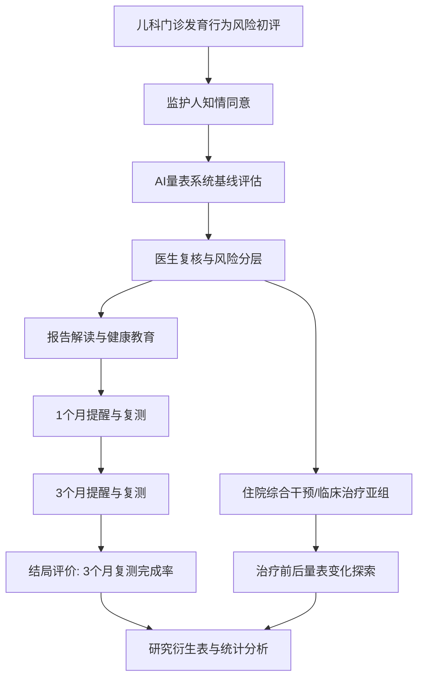

# 1. 总体判断

## 1.1 资料核对摘要

本交付基于以下材料核对：

- GitHub 仓库：`https://github.com/Handsome5201314/AIliangbiao`。本地副本 `main` 与远端 `origin/main` 均为 `29abf173ecd83c8cd3e6a9d027b62450378b6d05`，可视为当前公开仓库状态。
- 中国医院协会通知：`https://www.cha.org.cn/site/content/2b1d35861439bc9bd63efd938b548fc5.html`。正文明确为 2026 年“健康促进医院”创新项目，但网页 `<title>` 仍显示“2025年健康促进医院创新项目”，申报前建议电话或邮件核对页面标题残留问题。
- 申请书模板：本地 `中国医院协会2026健康促进申请书.pdf`。该 PDF 为图片型扫描模板，已渲染 7 页做视觉读取。
- 本地方法学材料：`吕军 重症数据库与SCI自由.md`、`The Crystal Ball Problem(1).docx`。

通知正文要点：

- 征集方向：方向1 建设健康环境；方向2 优化健康服务；方向3 强化健康教育；方向4 倡导健康文化；方向5 完善健康促进激励机制；方向6 实施健康体重管理；方向7 提升健康传播效能。
- 模板填表说明只列出方向1-6，未列方向7；邮件命名也写“方向(1/2/3/4/5/6)”。因此本项目封面建议主填“方向2 优化健康服务”，正文中兼顾“方向3 强化健康教育”，如协会确认可选方向7，再补充“提升健康传播效能”。
- 项目类别：重点项目、面上项目、指导性项目。
- 重点项目和面上项目有一定经费资助，实行后补助制，结项验收后拨付；指导性项目经费自筹。
- 通知未写具体资助金额。5000 元以内预算是按你的申报预期和模板说明做的建议，最终需按协会和单位财务口径确认。
- 研究期限：通知文字写“10个月(2026年9月-2027年9月)”，存在“10个月”和日期跨度不完全一致的问题。申请书建议按日期写“2026年9月-2027年9月”，核心数据采集写 6 个月。
- 材料要求：申请书 Word 版本和盖章版 PDF 扫描件；涉及人体研究或隐私数据者需伦理审查通过证明。
- 截止时间：2026年6月30日24:00前发送至 `yyjkcjkt@jsph.org.cn`。

申请书模板结构：

- 封面：项目类别、选题方向、项目名称、申请人、电话、依托单位、通讯地址、邮政编码、单位电话、电子邮箱、申报日期。
- 填表说明：项目类型、选题方向、项目组成员真实性和知情同意、字数要求、经费预算、Word 和盖章 PDF 提交要求。
- 基本信息：项目名称、主题词、申请人姓名、性别、出生年月、民族、学位、职称、研究时间（月）、电话、电子邮箱、专业领域、研究方向。
- 依托单位信息：单位名称、联系人、电话。
- 项目组成员：10人以内含申请人，栏目包括姓名、性别、出生年份、行政职务或职称、研究专长、工作单位、签名。
- 研究内容：选题依据（800字以内）、研究内容（1200字以内）、思路方法（500字以内）、创新之处（500字以内）、研究计划及预期成果（800字以内）。
- 研究基础和条件保障：学术简历、研究基础、条件保障、项目经费。
- 单位审核意见：单位意见、单位公章、年月日。

## 1.2 是否适合申报

适合申报，而且方向比较对口。最合适的申报口径不是“AI诊断孤独症”，也不是“软件开发项目”，而是：

> AI量表系统赋能儿童发育行为风险评估、健康教育、医生-家长协同随访和健康促进闭环管理。

匹配健康促进项目的理由：

- 研究对象是儿科门诊发育行为问题高风险儿童，属于需要早筛、早评、持续健康教育和随访管理的人群。
- 项目主线是优化门诊健康服务、强化健康教育、提升医生-家长协同随访效率，符合“健康促进医院”建设创新路径。
- 主结局设为 3 个月随访复测完成率，属于健康促进服务触达和管理闭环结局，不是敏感治疗疗效结局。
- 仓库已有儿童量表目录、医生端、家长端、门诊邀填、AI题目解释、医生复核、科研授权和导出雏形，具备申报支撑。

最大风险：

- 现有系统还没有把课题所需的 3 个月随访复测、健康教育触达、AI解释使用、报告查看、医生复核、住院亚组和研究衍生表打通为可直接分析的数据链。
- GitHub 仓库公开描述或历史表述中如出现“AI诊断”等字样，会增加评审和伦理风险。申请书和对外材料必须改成“AI辅助评估、解释、健康教育和医生复核”，不能写“诊断”。
- 若报重点项目，仅凭单中心、半年核心数据和当前功能成熟度，推广证据可能不足。

# 2. 申报方向建议

| 类别 | 是否建议 | 推荐口径 | 优点 | 风险 | 结论 |
|---|---:|---|---|---|---|
| 重点项目 | 可冲刺 | AI量表系统支持的儿童发育行为评估-健康教育-随访闭环模式构建与效果评价 | 创新性强，系统建设、流程规范、论文、软著都可讲 | 单中心、样本量较小、现有系统缺少结局日志和真实运行数据 | 作为第一志愿可冲，但要控制措辞，突出可复制模式和应用数据 |
| 面上项目 | 最推荐 | AI辅助儿童发育行为量表系统在门诊评估与家庭随访中的应用研究 | 目标稳、伦理风险低、半年核心数据可落地，适合 120-150 例 | 创新性不如重点项目，需要把方法学亮点写清楚 | 主推荐 |
| 指导性项目 | 兜底 | 儿童发育行为筛查、健康教育与随访复测流程构建 | 自筹经费可行，压力小，适合流程和系统原型沉淀 | 经费和项目影响力较弱，论文要求需要自己推进 | 若重点/面上竞争压力大，可保留成果目标但降级验证强度 |

## 2.1 适合健康促进口径的内容

- 门诊标准化发育行为量表评估。
- 医生辅助录入和家长自测随访复测。
- AI辅助题目解释、报告解读和健康教育内容触达。
- 随访提醒、复测完成、数据完整率和医生复核。
- 发育行为问题高风险儿童的健康促进闭环管理流程。
- 住院综合干预/临床治疗数据作为亚组分析。

## 2.2 不宜写入主线的内容

- AI诊断孤独症。
- AI替代医生。
- 验证具体敏感治疗对孤独症的疗效。
- 把课题写成纯软件开发。
- 把家长自测结果直接等同临床诊断结论。

## 2.3 只能作为探索性分析的内容

- 住院综合干预前后量表评分变化。
- 不同临床表型儿童评分变化。
- AI解释高使用和低使用儿童的随访完成差异。
- 历史对照与前瞻队列的倾向性评分分析。
- 目标试验模拟框架下的因果估计。

## 2.4 增加伦理或评审风险的表述

- “AI诊断孤独症”“AI筛出孤独症患儿”“AI自动判定治疗方案”。
- “验证某治疗治愈/改善孤独症”。
- “家长自测替代医生评估”。
- “无需医生复核即可出具医学结论”。
- “采集全部病历数据用于训练模型”但没有最小化、脱敏、授权和伦理说明。

# 3. 推荐课题题目

## 3.1 最推荐主题目

**基于AI量表系统的发育行为问题高风险儿童评估-健康教育-随访闭环模式构建与效果评价**

推荐类别：面上项目为主，重点项目可冲刺。

推荐理由：这个题目把核心放在“健康促进闭环”，既能承接 AI 量表系统，又不落入 AI 诊断或治疗疗效临床试验。主结局可设为 3 个月随访复测完成率，半年内能完成核心数据采集。

## 3.2 备选题目比较

| 题目 | 适合类别 | 优点 | 风险 | 健康促进匹配 | 系统匹配 | 半年核心数据 | 成果产出 |
|---|---|---|---|---|---|---|---|
| 基于AI量表系统的发育行为问题高风险儿童评估-健康教育-随访闭环模式构建与效果评价 | 面上/冲重点 | 主线清楚，兼顾系统、流程、评价 | “效果评价”需避免被理解为治疗疗效 | 高 | 高 | 可行 | 论文、软著、流程规范均可 |
| 基于医生-家长协同AI量表平台的孤独症谱系障碍特征及发育迟缓儿童随访管理研究 | 面上/重点 | 突出协同和随访 | 对象中出现 ASD，需避免狭窄诊断 | 高 | 高 | 可行 | 论文较容易 |
| AI辅助儿童发育行为量表系统在门诊评估与家庭随访中的应用研究 | 面上 | 稳妥、朴素、低风险 | 创新表达略弱 | 高 | 高 | 最可行 | 论文和软著稳 |
| 基于AI量表系统的儿童发育行为筛查、健康教育与随访复测模式研究 | 指导性/面上 | 适合小闭环和自筹 | 评价强度偏弱 | 高 | 中高 | 可行 | 流程规范、软著较稳 |
| 儿童发育行为问题高风险人群的AI辅助评估与标准化健康促进路径构建 | 指导性/面上 | 规避诊断风险，适合流程建设 | “路径构建”可能缺少硬结局 | 高 | 中 | 可行 | 指南/建议稿更稳 |

# 4. 研究对象如何表述

推荐表述：

> 本研究拟纳入儿科门诊就诊、经医生初步评估或家长主诉提示存在发育行为问题风险的儿童，包括已诊断孤独症谱系障碍、病历诊断为发育迟缓但存在孤独症谱系障碍核心特征，以及不满足孤独症谱系障碍诊断但存在语言、认知、社交、行为或适应能力发育落后的儿童。

可在申请书中进一步压缩为：

> 发育行为问题高风险儿童，包括孤独症谱系障碍特征、发育迟缓、语言发育迟缓、社交沟通障碍、行为发育问题及适应能力发育落后儿童。

不要写成：

- “孤独症儿童 AI 诊断研究”。
- “孤独症治疗效果研究”。
- “丙球/FMT 治疗孤独症有效性研究”。

# 5. 最终研究设计

## 5.1 研究类型

单中心、前后对照结合前瞻性队列的真实世界应用研究。

- 历史对照组：系统上线前接受常规门诊评估和非结构化随访的儿童。
- 系统干预组：系统上线后接受 AI量表系统支持的门诊评估、健康教育、随访提醒、家长端复测和医生复核的儿童。
- 住院综合干预/临床治疗者：作为亚组或探索性分析，不作为主线治疗有效性临床试验。

## 5.2 研究对象

依托医院儿科门诊及相关科室就诊的发育行为问题高风险儿童。建议年龄范围按量表适用年龄设置，主分析可设 0-12 岁；M-CHAT-R 等特定量表按原量表适用年龄执行。

## 5.3 纳入标准

1. 儿科门诊就诊，经医生初步评估或家长主诉提示存在发育行为风险。
2. 具备完成至少一种目标量表的年龄和认知/照护条件。
3. 监护人同意参与研究并签署知情同意。
4. 可通过门诊、电话或手机端完成 1 个月、3 个月随访。
5. 系统干预组需完成基线 AI量表系统评估。

## 5.4 排除标准

1. 急危重症或严重躯体疾病导致无法完成量表评估和随访。
2. 监护人拒绝知情同意或要求撤回研究数据。
3. 关键基线资料缺失且无法补充。
4. 同一儿童重复入组，仅保留首次符合条件记录。
5. 研究者判断存在明显不适合参与随访的情形。

## 5.5 对照组来源

历史对照来自系统上线前同一科室门诊记录、纸质量表、HIS/门诊随访记录或医生登记表。对照组应尽量纳入与干预组相同或相近的量表工具、年龄范围、临床表型和随访窗口。

## 5.6 干预组定义

首次在 AI量表系统中建立儿童档案并完成基线量表评估，随后接受至少以下一项闭环管理：

- AI辅助题目解释或标准化量表说明；
- 医生端报告复核；
- 健康教育内容推送或报告解读；
- 1个月或3个月随访提醒；
- 家长端复测或医生门诊复测。

## 5.7 干预措施

1. 医生端门诊测评：医生根据儿童主诉和初评选择 M-CHAT-R、ABC、CARS、SRS、SNAP-IV、ATEC、VINELAND-3 等量表，由医生辅助录入或交由家长在医生手机上填写。
2. AI辅助解释：对题目含义、填写注意事项和报告结果提供标准化解释，避免诱导性诊断结论。
3. 健康教育：根据风险等级和主要问题推送发育行为健康教育内容，包括就医建议、家庭观察要点和随访复测提醒。
4. 家长端随访复测：1个月和3个月通过手机端完成复测，系统记录完成情况、提醒触达和报告查看。
5. 医生复核：医生对量表结果和系统建议进行标准化复核，决定是否需要进一步门诊评估、转诊或持续随访。

## 5.8 主结局

3个月随访复测完成率。

建议定义：首次基线评估后第 75-105 天内完成至少一种约定量表复测，记为完成；未完成、失访或超出窗口记为未完成，并记录原因。

## 5.9 次要结局

- 量表数据完整率。
- 家长报告查看率。
- 健康教育内容阅读率。
- 医生标准化评估完成率。
- 医生评估耗时。
- 家长满意度和医生满意度。
- 基线至3个月主要量表评分变化。
- 住院综合干预亚组出院前/治疗后评分变化。

## 5.10 探索性结局

- 不同临床表型儿童的随访完成率差异。
- ASD特征明显、发育迟缓为主、语言发育迟缓为主等亚组评分变化。
- AI解释高使用与低使用儿童的随访完成率差异。
- 医生辅助录入、家长自测、家长接过医生手机填写三种填写模式的完成质量差异。
- 住院综合干预/临床治疗亚组的量表变化趋势。

## 5.11 样本量估算或可行性说明

建议保守写 120-150 例。可设计为历史对照 60-75 例、系统干预 60-75 例。若既往 3 个月复测完成率约 35%-45%，系统闭环后提高至 60%-70%，该样本量可支持对主要结局进行初步效果估计和多因素校正。考虑单中心项目和健康促进课题定位，本研究以可行性和真实世界应用效果评价为主，不宣称完成确证性随机对照试验。

## 5.12 数据来源

- AI量表系统数据库：儿童档案、评估会话、量表得分、填写模式、医生复核、随访复测、系统使用日志。
- 门诊/HIS记录：就诊时间、主诉、既往诊断、既往干预、住院情况。
- 住院记录：是否接受住院综合干预/临床治疗、入院和出院时间、治疗前后量表。
- 家长端数据：报告查看、健康教育阅读、随访提醒点击、复测完成。
- 医生端数据：评估耗时、复核记录、备注和满意度。

## 5.13 量表工具

主线儿童量表：

- M-CHAT-R：幼儿孤独症谱系障碍风险初筛。
- ABC：孤独症行为相关表现。
- CARS：医生复核导向的孤独症相关行为严重度评估。
- SRS：社交反应和社交沟通维度。
- SNAP-IV：注意缺陷和多动冲动相关行为。
- ATEC：发育行为干预过程中的症状变化观察。
- VINELAND-3：适应行为、沟通、日常生活技能、社会化等。

## 5.14 统计方法

### 描述性统计

- 连续变量：正态分布用均数和标准差；非正态分布用中位数和四分位数。
- 分类变量：用例数和百分比。
- 基线表：比较历史对照组和系统干预组的年龄、性别、基线量表风险、临床表型、是否住院、既往干预、家长教育程度或居住地等。

### 前后对照分析

- 3个月复测完成率、数据完整率、报告查看率等分类结局：卡方检验或 Fisher 精确检验。
- 医生评估耗时等连续变量：t 检验或 Mann-Whitney U 检验。
- 量表评分变化：配对 t 检验、Wilcoxon 符号秩检验，或线性混合模型。

### 回归分析

- 主要结局：以 3个月复测完成为因变量，采用多因素 Logistic 回归。
- 量表评分变化：采用线性回归、广义线性模型或混合效应模型。
- 随访时间：如能记录 time-to-followup，可用 Cox 回归或加速失效时间模型探索。

### 倾向性评分

如果历史对照组和系统干预组基线差异明显，采用 PSM 或 IPTW。协变量建议包括年龄、性别、基线风险等级、临床表型、是否住院、既往干预、医生、就诊月份、家长配合度或联系方式完整性。

### 亚组分析

- 住院综合干预亚组。
- ASD特征明显亚组。
- 发育迟缓为主亚组。
- 医生辅助录入 vs 家长自测。
- AI解释高使用 vs 低使用。

### 敏感性分析

- 改变高风险定义。
- 改变 3个月随访窗口，如 70-110 天、80-120 天。
- 排除缺失严重病例。
- 仅分析同一量表复测儿童。
- 排除历史对照中记录质量明显不足者。

### 缺失数据处理

- 描述缺失比例和缺失模式。
- 主要结局优先做完整病例分析，同时将失访作为未完成随访处理。
- 协变量缺失较多时可考虑多重插补。
- 对关键变量缺失做敏感性分析。

## 5.15 指标体系

### 基线信息

年龄、性别、出生史、早产/围产期情况、家族史、主诉、既往诊断、既往干预、是否住院、是否接受住院综合干预、家长教育程度、居住地。

### 量表数据

M-CHAT-R、ABC、CARS、SRS、SNAP-IV、ATEC、VINELAND-3 的总分、分维度得分、风险等级、测评时间点、填写模式。

测评时间点：基线、出院前/治疗后、1个月、3个月。

填写模式：医生辅助录入、家长自测、家长接过医生手机填写。

### 系统使用数据

是否使用 AI 题目解释、AI解释点击次数、健康教育内容阅读次数、报告查看时间、随访提醒发送次数、随访提醒点击情况、家长端复测完成情况、医生端复核情况。

### 健康促进结局

3个月随访复测完成率、量表数据完整率、家长报告查看率、家长健康教育阅读率、医生标准化评估完成率、医生评估耗时、家长满意度、医生满意度。

### 临床辅助结局

住院综合干预前后量表变化、不同临床表型儿童评分变化、不同随访依从性儿童评分变化、住院治疗者亚组量表变化、不同基线风险等级儿童随访完成情况。

## 5.16 数据安全与伦理

研究在依托单位伦理审批后开展。所有儿童数据以研究编号替代真实身份信息，导出数据不包含姓名、电话、身份证号等直接识别信息。系统仅采集研究所需最小数据集，限定授权研究人员访问。AI输出仅用于量表解释、健康教育和随访辅助，不作为诊断或治疗决策的唯一依据，最终临床判断由医生完成。

## 5.17 研究流程图

## 5.18 预期成果

1. 发表中文核心/科技核心或 SCI 论文 1 篇。
2. 申请软件著作权 1 项。
3. 形成儿童发育行为筛查健康促进流程 1 套。
4. 形成医院门诊应用规范或专家建议稿 1 份。
5. 完成 AI量表系统原型/平台 1 个。
6. 形成数据字典和研究衍生表设计。

# 6. 因果验证设计

## 6.1 方法学定位

The Crystal Ball Problem 的核心提醒是：预测模型只能回答“会发生什么”，不能自动回答“采取某个行动后会发生什么”。临床 AI 的价值不能停留在高风险预测，而要进入“预测结果嵌入决策流程后是否改善结局”的第二阶段评价。

本课题不以“AI预测孤独症”为主线，而是把 AI量表系统作为闭环管理工具，评价其对随访完成、数据完整、健康教育触达和医生复核等健康促进结局的影响。

## 6.2 第一阶段：预测/风险分层

- 输入：儿童基本信息、主诉、既往诊断、量表作答。
- 输出：量表总分、分维度得分、风险等级和需医生复核项。
- 作用：帮助医生标准化识别发育行为风险、选择后续健康教育和随访路径。
- 边界：不输出“AI诊断”，不替代临床诊断。

## 6.3 第二阶段：决策干预

将风险分层结果嵌入明确管理策略：

- 高风险：医生复核、强化健康教育、明确3个月复测提醒、必要时建议进一步专科评估。
- 中风险：健康教育、家庭观察清单、定期复测。
- 低风险但有主诉：提供基础健康教育和可选复测。

这个策略本身才是需要评价的“干预”，而不是单个预测分数。

## 6.4 结局评价

主要评价系统闭环管理是否提高：

- 3个月复测完成率；
- 数据完整率；
- 健康教育触达率；
- 报告查看率；
- 医生标准化评估完成率。

## 6.5 前后对照分析

比较系统上线前常规门诊路径和系统上线后闭环路径的健康促进结局。通过多因素回归、倾向性评分匹配或 IPTW 控制基线差异。

## 6.6 目标试验模拟探索性设计

- 时间零点：首次完成 AI量表系统评估当天。
- 纳入对象：发育行为问题高风险儿童。
- 干预策略：AI量表系统闭环管理，包括报告解读、健康教育、随访提醒、医生复核。
- 对照策略：系统上线前常规门诊评估和非结构化随访。
- 主要结局：3个月随访复测完成率。
- 次要结局：量表评分变化、数据完整率、健康教育触达率。
- 混杂因素：年龄、性别、基线量表风险、临床表型、是否住院、既往干预、家长配合程度、医生、就诊时间等。
- 分析方法：多因素 Logistic 回归、PSM 或 IPTW、分层分析、敏感性分析。

关键表述：

> 本研究的因果验证不是证明某种治疗有效，而是评价“AI量表闭环管理模式”对随访完成、数据完整和健康教育触达等健康促进结局的影响。

# 7. 吕军数据库思路如何迁移到本课题

## 7.1 可迁移的方法论

吕军讲座对本课题最有用的不是重症数据库本身，而是“系统建设 + 数据沉淀 + 论文产出”的路径：

1. 原始数据不能直接写论文，要先整理成研究衍生表。
2. 每个研究对象在核心分析表中尽量一人一行，关键事件和重复测量另建长表。
3. 回顾性队列“三板斧”可迁移：基线比较、结局或趋势比较、回归分析。
4. 指标、对象、结局和路径可以排列组合，形成持续论文生产线。
5. 新手课题先做小闭环：一个对象、一个系统路径、一个主要结局、一个可完成随访窗口。
6. 历史数据和前瞻数据可组合：历史数据提供对照，前瞻系统提供完整过程日志。

## 7.2 研究衍生表设计

### child_baseline_derived

| 字段 | 含义 | 来源 | 用途 |
|---|---|---|---|
| child_study_id | 脱敏研究编号 | MemberProfile/研究映射 | 研究主键 |
| sex | 性别 | 儿童档案 | 基线协变量 |
| age_months_index | 首次评估月龄 | 儿童档案/评估时间 | 基线协变量 |
| birth_history | 出生史摘要 | 病历/问卷 | 风险分层 |
| preterm_or_perinatal_flag | 早产或围产期异常 | 病历/家长问卷 | 协变量 |
| family_history_flag | 发育行为或精神心理家族史 | 问卷/病历 | 协变量 |
| chief_complaint_group | 主诉分组 | 门诊记录 | 表型分层 |
| baseline_diagnosis_group | 既往诊断分组 | HIS/医生录入 | 分层分析 |
| asd_feature_flag | 是否存在ASD核心特征 | 医生初评/量表 | 分层 |
| developmental_delay_flag | 是否发育迟缓为主 | 病历/医生初评 | 分层 |
| prior_intervention_flag | 既往干预 | 病历/家长问卷 | 混杂因素 |
| inpatient_flag | 是否住院 | HIS/医生录入 | 亚组 |
| guardian_education | 家长教育程度 | 问卷 | 可选协变量 |
| residence_type | 居住地 | 问卷 | 可选协变量 |
| index_date | 入组日期 | AssessmentSession | 时间零点 |

### assessment_session_derived

| 字段 | 含义 | 来源 | 用途 |
|---|---|---|---|
| session_id | 测评会话ID | AssessmentSession | 会话主键 |
| child_study_id | 研究编号 | MemberProfile映射 | 关联 |
| scale_id | 量表ID | AssessmentSession | 量表分层 |
| scale_version | 版本 | AssessmentSession/Scale catalog | 可追溯 |
| timepoint | 基线/出院前/1月/3月 | 随访计划 | 重复测量 |
| fill_mode | 医生辅助/家长自测/接手机填写 | UI/会话日志 | 质量分析 |
| channel | 门诊二维码/医生邀填/家长端 | AssessmentSession/Invite | 来源分析 |
| started_at | 开始时间 | AssessmentSession | 耗时计算 |
| completed_at | 完成时间 | AssessmentSession | 完成率 |
| duration_seconds | 测评耗时 | 计算 | 效率结局 |
| status | 完成/中断/过期 | AssessmentSession | 完成质量 |
| missing_item_count | 缺失题数 | answers | 完整率 |
| doctor_profile_hash | 医生脱敏ID | DoctorProfile | 医生效应 |

### scale_score_derived

| 字段 | 含义 | 来源 | 用途 |
|---|---|---|---|
| session_id | 会话ID | AssessmentSession | 关联 |
| child_study_id | 研究编号 | 映射 | 关联 |
| scale_id | 量表ID | AssessmentHistory | 分层 |
| total_score | 总分 | 确定性评分 | 主要分析 |
| dimension_scores_json | 分维度得分 | resultDetails | 机制探索 |
| risk_level | 风险等级 | 阈值规则 | 风险分层 |
| score_valid_flag | 是否有效 | 缺失和规则校验 | 敏感性分析 |
| baseline_score | 基线分 | 计算 | 变化值 |
| score_change_from_baseline | 相对基线变化 | 计算 | 次要结局 |
| threshold_crossing_flag | 是否跨风险等级 | 计算 | 探索性结局 |

### ai_interaction_derived

| 字段 | 含义 | 来源 | 用途 |
|---|---|---|---|
| child_study_id | 研究编号 | 映射 | 关联 |
| session_id | 会话ID | 系统日志 | 关联 |
| question_explanation_used | 是否使用AI题目解释 | Explanation log | AI触达 |
| explanation_click_count | 解释点击次数 | 前端日志 | 剂量指标 |
| ai_chat_message_count | AI会话轮数 | Agent logs | 使用强度 |
| report_interpretation_viewed | 是否查看报告解读 | Report view log | 触达 |
| health_education_read_count | 健康教育阅读次数 | Edu log | 触达 |
| health_education_read_seconds | 阅读时长 | 前端日志 | 触达质量 |
| doctor_review_support_used | 是否用于医生复核辅助 | 医生端日志 | 流程评价 |

### followup_derived

| 字段 | 含义 | 来源 | 用途 |
|---|---|---|---|
| child_study_id | 研究编号 | 映射 | 主键 |
| followup_plan_id | 随访计划ID | Followup plan | 关联 |
| due_date_1m | 1个月应随访日 | 计划 | 时间窗 |
| due_date_3m | 3个月应随访日 | 计划 | 主结局 |
| reminder_sent_count | 提醒发送次数 | Reminder log | 干预剂量 |
| reminder_click_count | 提醒点击次数 | Reminder log | 触达 |
| completed_1m_flag | 1月复测完成 | AssessmentSession | 过程结局 |
| completed_3m_flag | 3月复测完成 | AssessmentSession | 主结局 |
| completion_window_days | 完成时间差 | 计算 | 敏感性分析 |
| completion_mode | 家长端/门诊/电话辅助 | 会话/随访记录 | 分层 |
| lost_reason | 失访原因 | 随访记录 | 改进流程 |

### inpatient_intervention_derived

| 字段 | 含义 | 来源 | 用途 |
|---|---|---|---|
| child_study_id | 研究编号 | 映射 | 关联 |
| inpatient_flag | 是否住院 | HIS/医生录入 | 亚组 |
| admission_id_hash | 脱敏住院号 | HIS映射 | 关联 |
| admission_date | 入院日期 | HIS | 时间 |
| discharge_date | 出院日期 | HIS | 时间 |
| length_of_stay | 住院天数 | 计算 | 描述 |
| intervention_category | 住院综合干预/临床治疗 | 病历抽象 | 亚组描述 |
| pre_intervention_session_id | 治疗前量表 | AssessmentSession | 变化分析 |
| post_intervention_session_id | 出院前/治疗后量表 | AssessmentSession | 变化分析 |
| inpatient_notes_available | 是否有完整记录 | 病历 | 敏感性分析 |

### outcome_3m_derived

| 字段 | 含义 | 来源 | 用途 |
|---|---|---|---|
| child_study_id | 研究编号 | 映射 | 一人一行 |
| exposure_group | 历史对照/系统干预 | 入组时期 | 主暴露 |
| completed_3m_flag | 3月复测完成 | followup_derived | 主结局 |
| data_completeness_rate | 数据完整率 | 各表汇总 | 次要结局 |
| report_viewed_flag | 报告查看 | Report log | 次要结局 |
| health_education_touched_flag | 健教触达 | Edu log | 次要结局 |
| doctor_review_completed_flag | 医生复核完成 | Review log | 次要结局 |
| primary_scale_change | 主要量表变化 | scale_score_derived | 次要结局 |
| satisfaction_parent | 家长满意度 | 问卷 | 次要结局 |
| satisfaction_doctor | 医生满意度 | 问卷 | 次要结局 |
| censor_or_loss_flag | 截尾/失访 | 随访记录 | 敏感性分析 |

# 8. 申请书正文草稿

## 8.1 项目名称

最终推荐：

> 基于AI量表系统的发育行为问题高风险儿童评估-健康教育-随访闭环模式构建与效果评价

备选 1：

> AI辅助儿童发育行为量表系统在门诊评估与家庭随访中的应用研究

备选 2：

> 基于医生-家长协同AI量表平台的孤独症谱系障碍特征及发育迟缓儿童随访管理研究

## 8.2 项目类别

建议以面上项目为主，重点项目作为冲刺选择，指导性项目作为兜底选择。若申报重点项目，应在正文中强调健康促进流程创新、可复制模式、数据闭环和推广价值；若申报面上项目，则突出单中心真实世界应用评价和半年核心数据可落地。

## 8.3 选题方向

主选：方向2 优化健康服务。

辅选或正文体现：方向3 强化健康教育。

如协会确认可使用方向7，则可补充：提升健康传播效能。

## 8.4 研究背景与意义

儿童发育行为问题早期识别和持续管理是儿科健康促进工作的重要内容。孤独症谱系障碍特征、发育迟缓、语言发育迟缓、社交沟通障碍及行为发育问题儿童常需长期评估、健康教育和随访复测，但基层和综合医院门诊实际工作中仍存在纸质量表记录分散、医生解释时间有限、家长理解不一致、复测依从性不足、随访数据不连续等问题，影响发育风险的早期识别和健康促进服务闭环。

AI量表系统可将标准化量表、医生辅助录入、家长端自测、题目解释、报告解读、健康教育推送和随访提醒整合到同一流程中，提高量表评估规范性和医生-家长协同效率。本研究不以AI诊断为目标，而是围绕发育行为问题高风险儿童，构建“评估-健康教育-随访-复测-医生复核”的健康促进闭环，评价其对3个月随访复测完成率、数据完整率、报告查看率和健康教育触达率的影响。研究有助于形成可复制的儿科门诊发育行为筛查和健康促进流程，为医院健康促进服务创新提供真实世界数据和实践经验。

## 8.5 研究内容

1. 构建 AI量表系统支持的儿科门诊发育行为评估流程。围绕发育行为问题高风险儿童，建立儿童档案、基线量表选择、医生辅助录入、家长接续填写、医生复核和结果记录流程，优先纳入 M-CHAT-R、ABC、CARS、SRS、SNAP-IV、ATEC、VINELAND-3 等儿童发育行为相关量表。

2. 建立医生端测评和家长端随访复测协同流程。门诊阶段由医生根据主诉和初评选择量表，完成基线评估和风险分层；随访阶段由系统在1个月、3个月推送复测提醒，家长通过手机端完成复测，医生端进行必要复核和记录。

3. 构建发育行为风险分层与健康教育推送机制。系统根据量表总分、分维度得分和医生复核结果，提供标准化题目解释、报告解读和健康教育内容，帮助家长理解发育行为风险、家庭观察要点和随访复测要求。

4. 评价系统闭环管理对健康促进结局的影响。采用历史对照结合前瞻性队列设计，比较系统上线前后3个月随访复测完成率、量表数据完整率、报告查看率、健康教育阅读率、医生评估耗时和满意度等指标。对接受住院综合干预/临床治疗的儿童进行亚组探索，分析治疗前后量表评分变化，但不将具体治疗疗效作为主线研究目标。

## 8.6 思路方法

本研究采用单中心前后对照结合前瞻性队列设计。系统上线前同科室常规门诊评估和非结构化随访记录作为历史对照，系统上线后完成 AI量表系统基线评估并接受报告解读、健康教育、随访提醒和医生复核者作为系统干预组。以首次完成基线量表评估当天为时间零点，随访至3个月。主要结局为3个月随访复测完成率，次要结局包括数据完整率、报告查看率、健康教育阅读率、医生标准化评估完成率、医生评估耗时和量表评分变化。统计分析采用描述性统计、组间比较、多因素 Logistic 回归、线性或广义线性模型；若历史对照和前瞻队列基线差异明显，将采用倾向性评分匹配或 IPTW 进行敏感性分析。

## 8.7 创新之处

1. 从单次量表评估转向“评估-健康教育-随访-复测-医生复核”的儿童发育行为健康促进闭环。
2. 从单纯风险预测转向预测/风险分层后的决策流程评价，重点验证闭环管理是否改善随访完成、数据完整和健康教育触达等真实结局。
3. 将医生手机端门诊评估与家长手机端家庭复测结合，提升医生-家长协同效率。
4. 引入 AI辅助题目解释、报告解读和健康教育，但坚持医生复核和伦理边界，不以AI替代医生诊断。
5. 建立儿童发育行为量表真实世界数据库和研究衍生表，为后续论文产出、流程规范和区域推广提供数据基础。

## 8.8 研究计划及预期成果

项目周期按通知写为 2026年9月-2027年9月，核心数据采集预计 6 个月完成。

- 2026年9月-2026年10月：完成伦理审批、研究方案定稿、数据字典和衍生表设计、系统功能补齐和研究人员培训。
- 2026年11月-2027年4月：开展门诊前瞻性入组，完成基线评估、健康教育推送、1个月和3个月随访复测；同步整理历史对照数据。
- 2027年5月-2027年6月：完成数据清理、脱敏导出、衍生表生成和统计分析。
- 2027年7月-2027年9月：完成论文撰写、软件著作权材料、门诊应用规范或建议稿、结题报告和推广案例材料。

预期成果：

1. 中文核心/科技核心或 SCI 论文 1 篇。
2. 软件著作权 1 项。
3. AI量表系统原型/平台 1 个。
4. 儿童发育行为筛查健康促进流程 1 套。
5. 医院门诊应用规范或专家建议稿 1 份。
6. 数据字典和研究衍生表 1 套。

## 8.9 经费预算建议

通知未明确固定资助金额，仅说明重点项目和面上项目后补助、指导性项目自筹。按 5000 元以内建议：

| 项目 | 金额 | 用途 |
|---|---:|---|
| 系统部署维护 | 1500 元 | 域名、服务器、备份、日志和安全维护 |
| 健康教育材料制作 | 800 元 | 家长宣教材料、随访说明、流程图 |
| 数据收集与随访 | 1000 元 | 随访电话、短信/消息提醒、数据录入补贴 |
| 统计分析与资料整理 | 900 元 | 数据清理、统计分析、图表制作 |
| 打印/会议/伦理材料 | 800 元 | 申请书、知情同意、伦理材料、结题材料 |
| 合计 | 5000 元 | 按单位财务口径调整 |

## 8.10 伦理与数据安全

本研究将在依托单位伦理委员会审批通过后开展，纳入对象由监护人签署知情同意。研究采集儿童发育行为评估、随访复测和系统使用相关最小必要数据，使用研究编号替代姓名、电话等身份信息，导出分析数据前进行脱敏处理。数据仅限授权研究人员访问，操作过程保留日志。AI功能仅用于题目解释、健康教育、报告解读和随访辅助，不自动作出诊断，不作为治疗决策唯一依据。所有评估结果均由医生结合临床情况复核，涉及异常风险时按临床规范进一步评估和处理。

## 8.11 项目组成员建议

申请书要求项目组 10 人以内含申请人，建议角色如下，不编造真实姓名：

| 角色 | 人数 | 职责 |
|---|---:|---|
| 第一申请人：副主任医师王xx | 1 | 总体设计、临床把关、伦理和质量控制 |
| 项目协调/系统建设负责人 | 1 | 系统功能、数据字典、衍生表和交付协调 |
| 儿科医生 | 2 | 门诊入组、量表选择、医生复核 |
| 康复/心理评估人员 | 1-2 | 量表评估、家长沟通、质量控制 |
| 护理/随访人员 | 1-2 | 随访提醒、复测协调、失访原因记录 |
| 统计方法人员 | 1 | 统计方案、数据清理、模型分析 |
| 信息技术人员 | 1 | 系统部署、安全、日志和导出 |
| 伦理/数据管理人员 | 1 | 知情同意、脱敏、权限和审计 |

# 9. 仓库现状与差距

## 9.1 当前已具备的申报支撑

| 能力 | 仓库现状 | 申报支撑 |
|---|---|---|
| 量表 catalog | README 和 `lib/scales/catalog.ts` 已有儿童临床、探索、医生目录和语音白名单分层 | 支撑“标准化量表平台” |
| 儿童量表 | 已有 ABC、ATEC、CARS、M-CHAT-R、SRS、SNAP-IV、CBCL、TAS、VINELAND-3 等 | 支撑儿童发育行为主线 |
| 医生端 | `app/doctor/*`、医生注册审核、患者管理、门诊筛查、邀填、团队协作 | 支撑门诊医生辅助评估 |
| 家长端 | 首页、成员档案、公开邀填、handoff 页面、患者端授权组件 | 支撑家长填写和随访雏形 |
| 移动端 | `mobile-h5-prototype` 有医生/家长 H5 原型 | 交互方向明确，但仍是 mock |
| AI助手 | `/agent`、AI题目解释 API、知识库和 Hermes 相关能力 | 支撑 AI辅助解释与教育 |
| 报告 | 医生端单次报告导出 JSON/CSV/Word/PDF | 支撑医生复核和报告材料 |
| 历史记录 | `AssessmentHistory` 与患者详情时间线 | 支撑纵向量表记录 |
| 管理后台 | 医生审核、组织、知识审核、审计、策略管理 | 支撑治理和合规 |
| API | `/api/skill/v1/*`、`/api/doctor/*`、`/api/clinic/*`、`/api/platform/v1/*` | 支撑多端接入 |
| 数据模型 | Prisma 已有 User、MemberProfile、AssessmentSession、AssessmentHistory、ResearchConsent、ResearchExportLog 等 | 支撑基础研究数据 |
| 测试 | `tests/*.test.ts` 覆盖量表 catalog、Vineland、权限、CI、知识解释等 | 支撑工程质量 |

## 9.2 需特别说明的 mock 或未完成部分

- `mobile-h5-prototype/src/services/assessmentService.ts` 明确大量 TODO，当前 H5 医生/家长流程使用 `mockData`，不是生产数据链。
- `mobile-h5-prototype/src/services/authService.ts` 使用 mock 用户、mock token、mock 验证码，不能作为正式研究授权。
- 医生科研导出中心页面目前说明“后续批量科研导出与筛选工作流”，批量导出还未完成。
- 已有单成员科研导出和研究授权，但导出字段仅覆盖成员、量表、得分、结论、时间和研究备注，缺少课题主结局所需的触达、随访、复核和衍生字段。

## 9.3 当前缺少的科研课题必须功能

- 3个月随访复测字段和随访计划模型。
- 历史对照数据导入和质量标记。
- 住院综合干预亚组标记。
- AI解释使用日志。
- 健康教育触达日志。
- 家长报告查看日志。
- 医生复核日志。
- `outcome_3m_derived` 等研究衍生表。
- 批量导出研究数据功能。
- 正式伦理知情同意页面和版本化同意文本。
- 稳定脱敏研究编号映射表。
- 数据字典和字段口径说明。

# 10. 开发任务建议

## P0 必须做

1. 研究对象和测评 session 数据结构：新增研究入组、时间点、填写模式、医生复核状态、随访窗口字段。
2. 3个月随访复测记录：建立随访计划、提醒、完成状态、失访原因和复测关联会话。
3. AI解释和健康教育触达日志：记录题目解释点击、报告解读查看、健康教育阅读和提醒点击。
4. 医生端门诊测评：让医生端能发起、选择量表、辅助录入、交给家长填写、完成复核。
5. 家长端随访复测：把 H5 原型接入真实 API，替换 mock token 和 mock data。
6. 研究数据导出/衍生表：导出 child_baseline、assessment_session、scale_score、followup、outcome_3m 等表。
7. 知情同意和隐私说明：正式页面、版本号、文本 hash、撤回机制、审计日志。

## P1 建议做

1. 住院综合干预亚组字段：住院标记、入出院时间、住院综合干预/临床治疗摘要、治疗前后量表关联。
2. 报告查看日志：家长报告查看时间、次数、来源。
3. 满意度问卷：家长和医生各 3-5 个简短条目。
4. 统计导出：自动生成 CSV、数据字典和基本统计汇总。
5. 历史数据导入：支持 CSV 导入、字段映射、质量标记和历史对照分组。

## P2 后续扩展

1. 高级因果分析模块：PSM/IPTW 配置和分析脚本。
2. 自动统计报表：一键生成基线表、主结局表和流程图。
3. 多中心/多机构支持：机构分层、数据隔离、多中心结局比较。

# 11. 风险与规避

| 风险 | 具体表现 | 规避策略 |
|---|---|---|
| 诊断名称风险 | 写成“AI诊断孤独症” | 全文统一写“AI辅助评估、风险分层、医生复核” |
| 治疗疗效风险 | 把住院综合干预写成治疗有效性试验 | 主线只评价闭环管理；住院者仅作亚组探索 |
| 样本量风险 | 120-150 例不足以做复杂因果分析 | 主结局聚焦随访完成率；目标试验模拟作为探索 |
| 随访流失风险 | 3个月复测完成不足 | 设置多次提醒、电话补访、记录失访原因 |
| 历史对照质量风险 | 纸质/病历数据缺失多 | 设质量标记，做敏感性分析，不强行混合 |
| 伦理风险 | 儿童数据和隐私数据敏感 | 伦理审批、监护人同意、脱敏、最小化采集、权限控制 |
| AI夸大风险 | 宣称 AI 自动判断治疗或诊断 | 明确 AI 不替代医生，不作为治疗决策唯一依据 |
| 仓库功能落差风险 | 申报写的闭环与系统现状不一致 | 申报写“构建与评价”，开发 P0 先补随访和日志 |
| 通知口径风险 | 官网标题 2025、正文 2026；方向7与模板不一致 | 申报前电话/邮件核对，封面优先写方向2/3 |

# 12. 还需要向你确认的问题

1. 依托单位和科室的正式名称、通讯地址、邮编、单位电话、邮箱。
2. 第一申请人王xx的学历、职称、研究基础、近年论文或项目经历。
3. 是否已有伦理委员会流程，以及能否在 2026年6月30日前提交伦理受理或伦理批件。
4. 门诊月均可纳入病例数，是否能在 6 个月内完成 120-150 例。
5. 历史对照数据是否已有纸质量表、电子表格或 HIS 导出，字段完整度如何。
6. 3个月随访目前是否已有电话/微信/门诊复诊记录可追踪。
7. 是否确定项目类别第一志愿为重点项目，还是稳妥报面上项目。
8. 申请书封面“选题方向”是否只允许填写一个方向；若只填一个，建议填“方向2 优化健康服务”。
9. 软件著作权是否以当前 AIliangbiao 系统为基础申请，名称是否使用“智伴童行 儿童发育行为量表AI平台”。
10. 是否允许把现有公开描述或历史材料中不合适的“AI诊断”相关表述改成“AI辅助评估与医生复核”。
