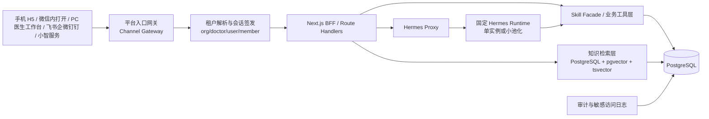
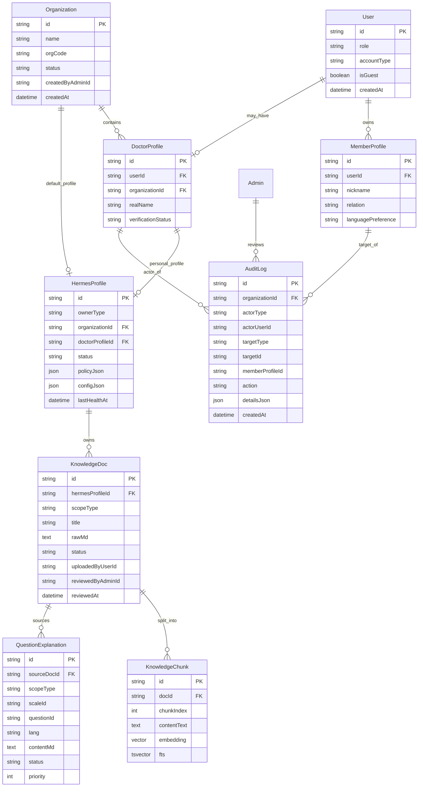
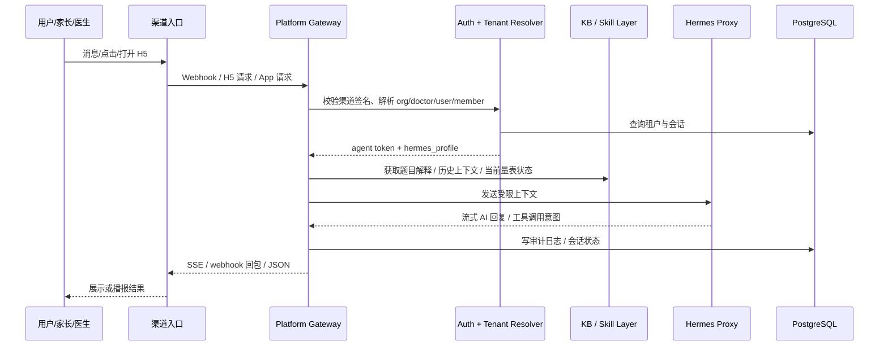
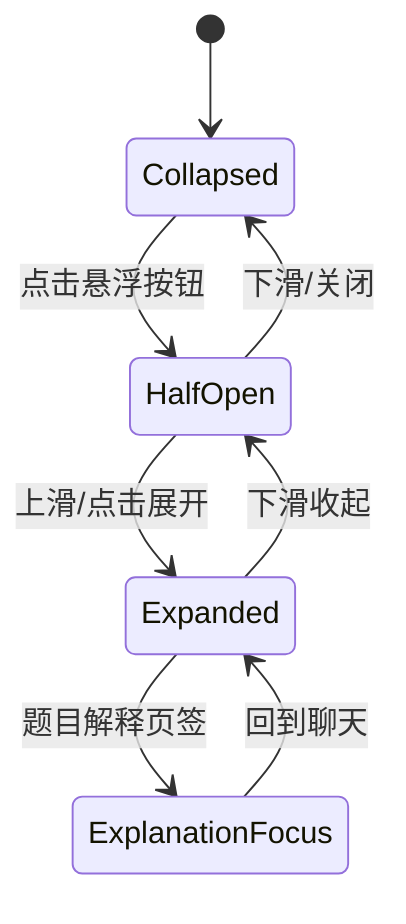
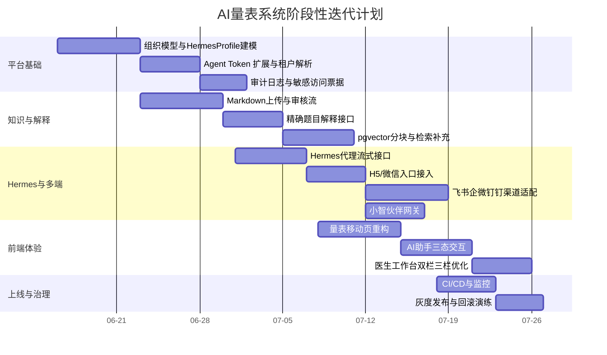

# AI量表系统持续开发指南

## 执行摘要

`Handsome5201314/AIliangbiao` 当前已经不是“单一量表站”，而是一套以 Next.js App Router + Prisma + PostgreSQL 为基础，围绕 Web/UI、Assessment Core、Agent/MCP 三层组织起来的综合评测系统；仓库 README 已明确写出系统分层、`/agent` 智能体入口、医生/患者链路、管理后台与 Skill Facade 结构，`package.json` 显示当前主栈为 Next.js 16、Prisma 5、React 19、Tailwind 3，`components.json` 与 Tailwind 配置表明项目已采用 shadcn/ui + Radix + Tailwind 的统一组件体系。fileciteturn2file1L5-L39 fileciteturn2file1L121-L280 fileciteturn2file1L281-L420 fileciteturn1file1L5-L44 fileciteturn45file0L5-L24 fileciteturn46file0L9-L79

当前仓库已经具备一个很好的“继续演进”起点：一方面，`/api/agent/session` 会签发带 `member_id`、`doctor_profile_id`、`scopes` 的受控 token；另一方面，Skill 路由会基于该 token 做 scope 校验，并在成员上下文路由里强制 `memberId === session.member_id`，这说明你们已经有一条正确的“AI 不直连数据库、只走受控工具层”的技术路线。与此同时，当前移动端还只是 `ResponsiveAgentWorkspace -> MobileAgentWorkspace -> <AgentWorkspace mobile />` 的轻包装，实时对话里的 Hermes conversation proxy 也仍是占位返回，知识面板仍保留 FastGPT 嵌入式通道，因此要达到你确认的目标效果，还需要系统性补齐“多租户机构层、知识库审核、精确题目解释、Hermes 代理层、移动专用交互、多端接入网关、审计与敏感访问流程”。fileciteturn48file0L16-L28 fileciteturn48file0L65-L99 fileciteturn49file0L9-L13 fileciteturn51file0L14-L22 fileciteturn7file1L12-L33 fileciteturn8file1L9-L10 fileciteturn60file0L67-L83 fileciteturn62file0L127-L143

本指南的核心结论是：**第一阶段不要做“每个用户单起一个 Hermes Docker 容器”**。更合理的方案是，维持你现有的**单平台后端入口**与**单机三服务部署**思路，在同一台 4 核 4G 服务器上继续使用一个固定的 Hermes API Server（或小规模固定进程池），所有 Web/H5、微信内打开、PC 医生工作台、飞书/企微/钉钉机器人、小智服务都先进入你自己的平台后端，由平台后端做 `organization -> doctor -> user -> member` 的租户解析、权限收敛、会话签名、知识检索与审计记录，再把**受限上下文**转发给 Hermes。这样既不会混淆多用户信息，也能复用现有 `/api/agent/session` 与 `/api/skill/v1/*` 的隔离思路。当前生产 compose 也已经是 `app + db + hermes` 单机三容器结构，`hermes` 用 `gateway run` 启动，`app` 通过 `HERMES_API_SERVER_BASE_URL=http://hermes:8642/v1` 访问内部 Hermes API Server，这和推荐的第一阶段目标是一致的。fileciteturn42file0L7-L80 fileciteturn44file0L7-L18

数据库方面，第一阶段也**不建议拆成两个数据库**。你当前项目已经默认“单机 PostgreSQL + Prisma URL”，README 里本地开发和云端部署都明确要求使用 PostgreSQL URL 形式的 `DATABASE_URL / DIRECT_URL`，而 PostgreSQL 的 `text` 类型可以直接存储任意长度字符串，实践上单字段上限约 1GB；因此 Markdown 原文、审核状态、版本、`tsvector`、`pgvector` 都可以先落在同一个 PostgreSQL 实例中，以**单库多表 + 应用层租户隔离**为主、Row-Level Security 作为后续增强。fileciteturn2file1L421-L580 citeturn26view0 citeturn26view1

技术选型上，推荐路线是：**手机 Web/H5 优先，微信内打开兼容；PC 医生工作台作为同一套 React 业务组件的桌面布局；飞书/企微/钉钉/小智都走平台网关；知识库采用“平台标准解释优先 + 医生自定义补充叠加”的双层检索；向量检索先用 PostgreSQL + pgvector，共机、低运维、够你第一阶段使用。** Tailwind 官方响应式文档强调它是 mobile-first，未加前缀的样式默认作用于移动端，适合先做移动布局再逐层增强；Next.js Route Handlers 官方也明确支持自定义请求处理、动态路由、非 UI 响应与流式输出，因此你现有 Next.js 应用完全可以继续承担平台 BFF、SSE 流式 AI 输出和多端网关的角色。citeturn25view0 citeturn24view0turn24view4turn24view2turn24view3

本文以下所有实施建议，都以你已经确认的基线为前提：**主入口优先级为手机 Web/H5 > 微信内打开 > 电脑端医生工作台 > 飞书/企微/钉钉等机器人 > 小智服务/AI 玩具；租户隔离粒度为机构优先、医生归属机构；平台内置标准知识库，医生上传补充知识库且必须审核；解释策略为 `scaleId + questionId` 精确解释优先，再做向量补充；后台支持 Markdown 编辑与 `.md` 上传；第一阶段继续共机 PostgreSQL；电话式语音放到第二阶段；且所有入口都先经过你自己的平台后端。** 其中“流量规模、日活峰值、是否已有 CI Workflow、最终嵌入模型维度、生产域名/CDN 方案”在仓库中没有完整披露，本文按阶段一中小规模 SaaS 的合理假设来设计。fileciteturn2file1L281-L420 fileciteturn44file0L52-L63

## 现状审计与目标架构

### 仓库现状与继续演进的抓手

从仓库结构看，当前系统已经把 Web/UI、`app/api/skill/v1/*` 的 Skill Facade、`packages/assessment-skill` 的核心包、`prisma/schema.prisma` 的业务数据模型和后台管理接口分离出来；README 还明确把 `app/agent`、`app/admin`、`app/doctor`、`app/api/skill/v1`、`app/api/mcp`、`packages/assessment-skill` 列成了清晰的分层目录。对持续迭代来说，这意味着你不需要推翻重做，而是可以沿着现有目录继续做“加法式演进”。fileciteturn2file1L281-L420 fileciteturn2file1L421-L580

当前仓库已经有几条非常重要的“正确抽象”。第一条是**受控 Agent Session**：`issueAgentSessionToken` 生成的 payload 已包含 `sub`、`member_id`、`account_type`、`doctor_profile_id`、`scopes`、`device_id`、`session_id`、`exp` 等字段；`authenticateSkillRequest` 再统一解析 Bearer token 并校验 scope。第二条是**成员级隔离**：成员上下文接口在通过 token 认证后，还会显式校验 `memberId !== session.member_id` 时返回 403。第三条是**统一会话引导**：`/api/agent/session` 会根据患者、游客、AI 玩具等不同入口解析当前 `user/member/profile`，再对前端返回统一的 account/member/members 结构。你想要的多端、多租户、多设备，实际上都可以沿这条链路继续扩展。fileciteturn48file0L16-L28 fileciteturn48file0L65-L99 fileciteturn49file0L9-L13 fileciteturn51file0L14-L22 fileciteturn52file0L37-L112 fileciteturn63file0L114-L176

但当前仓库也有几个决定了“下一步必须改”的缺口。第一，Prisma 模型里现在有 `DoctorProfile`、`CareTeam`、`Admin`、`ApiKey`、`McpLog`、`DoctorBotConfig`，但没有显式的 `Organization` 主租户模型；而且 `DoctorProfile`、`CareTeam` 仍然用 `hospitalName/departmentName` 这类机构信息字段承载语义，不足以支撑你要的“机构优先”租户体系。第二，`DoctorBotConfig` 目前明显是围绕 FastGPT 组织：字段包括 `fastgptBaseUrl` 与 `fastgptApiKeyEncrypted`，说明医生私有机器人还停留在外部知识面板集成层。第三，实时对话的 Hermes 路由还只是“proxy is ready”的占位返回，说明真正的 Hermes conversation proxy 还没接上。fileciteturn3file1L303-L308 fileciteturn3file1L449-L454 fileciteturn3file1L649-L666 fileciteturn3file1L598-L603 fileciteturn3file1L834-L847 fileciteturn60file0L67-L83

前端层面，你当前的基础设施足够好：`components.json` 表明项目使用的是 shadcn/ui `new-york` 风格、RSC 打开、lucide 图标库与 Tailwind CSS；`tailwind.config.ts` 已统一字体、圆角与颜色变量；`app/layout.tsx` 已把认证、成员、技能会话、历史会话等 Provider 放在根布局中。这意味着你完全适合走“**一套 React 业务组件 + 移动优先响应式布局 + 针对量表页与 AI 助手页单做移动交互壳**”的路线。问题只在于：当前移动端实现还只是 `ResponsiveAgentWorkspace` 根据 `max-width: 767px` 派发到 `MobileAgentWorkspace`，而 `MobileAgentWorkspace` 又只是简单返回 `<AgentWorkspace mobile />`；这还称不上你想要的“浮动按钮 + 半展开底部抽屉 + 右侧知识面板式混合”的移动交互系统。fileciteturn45file0L5-L24 fileciteturn46file0L17-L79 fileciteturn47file0L25-L42 fileciteturn7file1L12-L33 fileciteturn8file1L9-L10 fileciteturn9file8L209-L215

部署层面，仓库现状和你的目标也高度匹配。`docker-compose.prod.yml` 目前就是单机 `db + hermes + app` 三服务，`hermes` 使用 `nousresearch/hermes-agent:latest` 加 `gateway run` 启动，`app` 通过内部地址 `http://hermes:8642/v1` 访问它；部署文档也明确建议 PostgreSQL 不对公网开放、由 Nginx 统一承接 80/443。Hermes 官方文档则说明 Hermes 本身支持从单个 gateway 进程覆盖 Telegram、Discord、Slack、WhatsApp、Signal、DingTalk、Feishu、WeCom、Weixin、Teams 等 20+ 平台，并且可以运行在低成本 VPS 上。这进一步说明：你的一阶段目标最适合做成“**你的平台后端先汇聚所有入口，Hermes 作为平台内 AI Runtime 子系统，而不是每个渠道、每个用户各起一套容器**”。fileciteturn42file0L29-L80 fileciteturn44file0L7-L18 citeturn17view0 citeturn21view0

### 目标架构与核心原则

目标架构建议如下：



这个架构有四条不能动的原则。第一，**Hermes 不直接读业务库**。它只能调用你平台暴露的工具，工具层再根据会话中的 `organizationId / doctorProfileId / userId / memberId` 去查数据库。第二，**数据隔离以平台后端为准，不以 Hermes 内存为准**。Hermes 只是执行智能工作流，不是租户边界。第三，**一个 Hermes Profile 是你的平台抽象，不要求“一个请求一个容器”**。第四，**所有外部入口都通过同一个平台签名入口转成统一的业务会话上下文**，这样 Web/H5、机器人、AI 玩具才能共享一份审计、权限、知识库和量表解释体系。这个原则与仓库 README 中“智能体不能直接读数据库、只能通过受控 token 访问 skill facade、只能读取当前用户+当前成员数据”的现有设计是一致的。fileciteturn2file1L381-L426 fileciteturn51file0L14-L22

在前后端实现层面，这个目标架构也符合官方技术路线。Next.js Route Handlers 本来就是给 `route.ts` 形式的自定义 Request/Response 处理准备的，并且官方明确支持动态路由和非 UI 响应；与此同时，Server Components 默认负责服务器数据获取，`"use client"` 只应该下沉到真正有互动的局部组件，这也正适合你把大部分“页面数据装配”留在服务器，只把聊天面板、抽屉、悬浮按钮、录音控制等做成 Client Components。citeturn24view0turn24view4 citeturn24view2turn24view3

## 数据模型与接口设计

### 关键建模决策

首先是数据库组织方式。对你当前阶段，最优解不是双库，而是**单 PostgreSQL 实例 + 同库多表 + 应用层隔离**。原因有三点：一是仓库当前就围绕单 PostgreSQL URL 在开发和部署；二是 PostgreSQL `text` 可以直接承载 Markdown 原文，物理超长值会自动压缩/外置存储；三是 PostgreSQL 自身就支持全文检索、JSONB 与 Row-Level Security，可以一边满足知识库、一边满足审计和隔离增强。fileciteturn2file1L421-L580 citeturn26view0turn28view0turn26view1

其次是租户主键。你已经确认“机构优先，医生归属机构”，所以推荐设计为：**组织是一级租户，医生是组织下资源拥有者，家长/儿童则通过 userId/memberId 继续分层隔离**。这意味着 Hermes profile 的归属要支持两种 owner：`ORGANIZATION` 或 `DOCTOR`。第一阶段只开两种情况：有机构归属的医生统一继承组织 profile；独立医生可以拥有自己的 doctor-level profile。这样既符合“一个医生/机构 = 一个 Hermes profile”的确认，又不会把机构内多个医生错误拆成很多隔离运行时。这个抽象是为了适配你的业务，不要求 Hermes 原生必须有同名对象。这个设计之所以必要，也正是因为当前 schema 只有 `DoctorProfile` 与 `CareTeam`，没有显式 `Organization`。fileciteturn3file1L303-L308 fileciteturn3file1L449-L454

再次是知识库与解释策略。建议把解释分成两层：**问题级精确解释**与**文档级向量补充**。前者用 `question_explanations`，按 `scale_id + question_id + lang + scope` 精确命中；后者用 `knowledge_docs + knowledge_chunks`，对 Markdown 文档切块并写入向量。回答时按你确认的顺序执行：

1. 平台标准 `question_explanations` 精确命中  
2. 机构/医生已审核通过的 `question_explanations` 追加补充  
3. 若仍不足，再对 `knowledge_chunks` 做向量检索  
4. 最终由 LLM 组织成：“平台标准解释在前，医生自定义补充在后”的合成回答

这个策略同时把“权威性”和“灵活性”兼顾了。PostgreSQL 全文检索可以识别自然语言文档并按相关性排序，`tsvector`/`tsquery` 也适合做第一轮补充召回；pgvector 则可以在同库中提供精确或近似近邻检索。citeturn28view0 citeturn29view0turn30view2turn30view0

### 单库与双库比较

| 方案 | 适用阶段 | 优点 | 缺点 | 本项目建议 |
|---|---|---|---|---|
| 单 PostgreSQL 实例 | 第一阶段 | 运维最简单；复用现有 Prisma/部署方式；知识、审计、业务事务可统一落库 | 需要更严格的表设计与租户过滤 | **推荐** |
| 业务库 + 知识库双库 | 第二阶段以后 | 可独立扩缩容；搜索负载与业务负载分离 | 4C4G 共机会更复杂；备份恢复更难；开发成本更高 | 暂不建议 |
| 多机构独立库 | 大客户定制 | 最强物理隔离 | 成本极高；不适合当前阶段 | 仅保留未来预案 |

### ER 图



### 数据库迁移脚本

下面这份迁移脚本是**基于当前仓库做增量改造**，不会破坏现有 `User / ChildProfile(MemberProfile) / DoctorProfile / AssessmentHistory / Admin / ApiKey / McpLog` 主体结构；它做的只是：新增机构、Hermes profile、知识文档、知识分块、题目解释、审计日志，并给 `DoctorProfile` 增加组织外键。当前 schema 中确实已有 `User`、`MemberProfile(物理表 ChildProfile)`、`DoctorProfile`、`AssessmentHistory`、`AssessmentSession`、`Admin`、`ApiKey`、`McpLog` 等模型，因此这类 additive migration 最稳。fileciteturn3file1L112-L117 fileciteturn3file1L194-L199 fileciteturn3file1L220-L257 fileciteturn3file1L303-L308 fileciteturn3file1L598-L603 fileciteturn3file1L649-L666

```sql
-- 0001_org_hermes_kb_audit.sql

BEGIN;

CREATE EXTENSION IF NOT EXISTS vector;

CREATE TABLE IF NOT EXISTS "Organization" (
  id                  TEXT PRIMARY KEY DEFAULT gen_random_uuid()::text,
  name                TEXT NOT NULL,
  org_code            TEXT UNIQUE,
  status              TEXT NOT NULL DEFAULT 'ACTIVE',
  contact_name        TEXT,
  contact_phone       TEXT,
  created_by_admin_id TEXT REFERENCES "Admin"(id) ON DELETE SET NULL,
  created_at          TIMESTAMPTZ NOT NULL DEFAULT now(),
  updated_at          TIMESTAMPTZ NOT NULL DEFAULT now()
);

ALTER TABLE "DoctorProfile"
  ADD COLUMN IF NOT EXISTS organization_id TEXT REFERENCES "Organization"(id) ON DELETE SET NULL,
  ADD COLUMN IF NOT EXISTS job_title TEXT,
  ADD COLUMN IF NOT EXISTS is_org_owner BOOLEAN NOT NULL DEFAULT false;

CREATE INDEX IF NOT EXISTS idx_doctor_profile_org ON "DoctorProfile"(organization_id);

CREATE TABLE IF NOT EXISTS "HermesProfile" (
  id                    TEXT PRIMARY KEY DEFAULT gen_random_uuid()::text,
  owner_type            TEXT NOT NULL CHECK (owner_type IN ('ORGANIZATION','DOCTOR')),
  organization_id       TEXT UNIQUE REFERENCES "Organization"(id) ON DELETE CASCADE,
  doctor_profile_id     TEXT UNIQUE REFERENCES "DoctorProfile"(id) ON DELETE CASCADE,
  status                TEXT NOT NULL DEFAULT 'READY',
  display_name          TEXT NOT NULL,
  api_base_url          TEXT,
  model_name            TEXT,
  config_json           JSONB NOT NULL DEFAULT '{}'::jsonb,
  policy_json           JSONB NOT NULL DEFAULT '{}'::jsonb,
  last_health_at        TIMESTAMPTZ,
  last_health_status    TEXT,
  created_at            TIMESTAMPTZ NOT NULL DEFAULT now(),
  updated_at            TIMESTAMPTZ NOT NULL DEFAULT now(),
  CHECK (
    (owner_type = 'ORGANIZATION' AND organization_id IS NOT NULL AND doctor_profile_id IS NULL) OR
    (owner_type = 'DOCTOR' AND doctor_profile_id IS NOT NULL AND organization_id IS NULL)
  )
);

CREATE TABLE IF NOT EXISTS "KnowledgeDoc" (
  id                    TEXT PRIMARY KEY DEFAULT gen_random_uuid()::text,
  hermes_profile_id     TEXT REFERENCES "HermesProfile"(id) ON DELETE CASCADE,
  scope_type            TEXT NOT NULL CHECK (scope_type IN ('PLATFORM','ORGANIZATION','DOCTOR')),
  organization_id       TEXT REFERENCES "Organization"(id) ON DELETE CASCADE,
  doctor_profile_id     TEXT REFERENCES "DoctorProfile"(id) ON DELETE CASCADE,
  title                 TEXT NOT NULL,
  slug                  TEXT,
  source_type           TEXT NOT NULL DEFAULT 'MARKDOWN',
  raw_md                TEXT NOT NULL,
  rendered_html         TEXT,
  status                TEXT NOT NULL DEFAULT 'PENDING_REVIEW',
  uploaded_by_user_id   TEXT REFERENCES "User"(id) ON DELETE SET NULL,
  reviewed_by_admin_id  TEXT REFERENCES "Admin"(id) ON DELETE SET NULL,
  reviewed_at           TIMESTAMPTZ,
  review_comment        TEXT,
  metadata_json         JSONB NOT NULL DEFAULT '{}'::jsonb,
  created_at            TIMESTAMPTZ NOT NULL DEFAULT now(),
  updated_at            TIMESTAMPTZ NOT NULL DEFAULT now()
);

CREATE INDEX IF NOT EXISTS idx_kb_doc_scope_status
  ON "KnowledgeDoc"(scope_type, status, organization_id, doctor_profile_id);

CREATE TABLE IF NOT EXISTS "KnowledgeChunk" (
  id                    TEXT PRIMARY KEY DEFAULT gen_random_uuid()::text,
  doc_id                TEXT NOT NULL REFERENCES "KnowledgeDoc"(id) ON DELETE CASCADE,
  chunk_index           INT NOT NULL,
  scale_id              TEXT,
  question_id           TEXT,
  content_text          TEXT NOT NULL,
  token_count           INT,
  embedding             vector(768),
  metadata_json         JSONB NOT NULL DEFAULT '{}'::jsonb,
  created_at            TIMESTAMPTZ NOT NULL DEFAULT now(),
  UNIQUE(doc_id, chunk_index)
);

-- 初期数据量不大时可以先不上 ANN 索引；
-- 块数上来后再开 HNSW 或 IVFFlat。
-- CREATE INDEX idx_kb_chunk_embedding_hnsw
--   ON "KnowledgeChunk" USING hnsw (embedding vector_cosine_ops);

CREATE TABLE IF NOT EXISTS "QuestionExplanation" (
  id                    TEXT PRIMARY KEY DEFAULT gen_random_uuid()::text,
  source_doc_id         TEXT REFERENCES "KnowledgeDoc"(id) ON DELETE SET NULL,
  scope_type            TEXT NOT NULL CHECK (scope_type IN ('PLATFORM','ORGANIZATION','DOCTOR')),
  organization_id       TEXT REFERENCES "Organization"(id) ON DELETE CASCADE,
  doctor_profile_id     TEXT REFERENCES "DoctorProfile"(id) ON DELETE CASCADE,
  scale_id              TEXT NOT NULL,
  question_id           TEXT NOT NULL,
  lang                  TEXT NOT NULL DEFAULT 'zh-CN',
  content_md            TEXT NOT NULL,
  status                TEXT NOT NULL DEFAULT 'PENDING_REVIEW',
  priority              INT NOT NULL DEFAULT 100,
  created_at            TIMESTAMPTZ NOT NULL DEFAULT now(),
  updated_at            TIMESTAMPTZ NOT NULL DEFAULT now()
);

CREATE INDEX IF NOT EXISTS idx_qexp_exact
  ON "QuestionExplanation"(scale_id, question_id, lang, scope_type, status, organization_id, doctor_profile_id, priority);

CREATE TABLE IF NOT EXISTS "AuditLog" (
  id                    TEXT PRIMARY KEY DEFAULT gen_random_uuid()::text,
  organization_id       TEXT REFERENCES "Organization"(id) ON DELETE SET NULL,
  actor_type            TEXT NOT NULL CHECK (actor_type IN ('USER','DOCTOR','ADMIN','SYSTEM','CHANNEL')),
  actor_user_id         TEXT REFERENCES "User"(id) ON DELETE SET NULL,
  actor_admin_id        TEXT REFERENCES "Admin"(id) ON DELETE SET NULL,
  doctor_profile_id     TEXT REFERENCES "DoctorProfile"(id) ON DELETE SET NULL,
  member_profile_id     TEXT REFERENCES "ChildProfile"(id) ON DELETE SET NULL,
  target_type           TEXT NOT NULL,
  target_id             TEXT,
  action                TEXT NOT NULL,
  ip_hash               TEXT,
  user_agent            TEXT,
  details_json          JSONB NOT NULL DEFAULT '{}'::jsonb,
  created_at            TIMESTAMPTZ NOT NULL DEFAULT now()
);

CREATE INDEX IF NOT EXISTS idx_audit_actor_time ON "AuditLog"(actor_type, created_at DESC);
CREATE INDEX IF NOT EXISTS idx_audit_target_time ON "AuditLog"(target_type, target_id, created_at DESC);
CREATE INDEX IF NOT EXISTS idx_audit_member_time ON "AuditLog"(member_profile_id, created_at DESC);

COMMIT;
```

PostgreSQL 官方指出 `text` 是可变长、无限长度的原生字符串类型，长文本会自动压缩，极长值会外置到后台表；这正是把 Markdown 原文直接放数据库的合适做法。与此同时，全文检索章节说明 PostgreSQL 可以把文档预处理为 `tsvector` 并按相关性做搜索；pgvector 官方 README 则表明你可以和现有业务数据一起把向量存放在 Postgres 里，并支持精确与近似近邻搜索。citeturn26view0turn28view0turn29view0turn30view2

### 检索与优先级逻辑

第一层精确解释建议直接走 SQL 或 Prisma + SQL 混合：

```sql
-- exact first
SELECT *
FROM "QuestionExplanation"
WHERE scale_id = $1
  AND question_id = $2
  AND lang = $3
  AND status = 'APPROVED'
  AND (
    scope_type = 'PLATFORM'
    OR (scope_type = 'ORGANIZATION' AND organization_id = $4)
    OR (scope_type = 'DOCTOR' AND doctor_profile_id = $5)
  )
ORDER BY
  CASE scope_type
    WHEN 'PLATFORM' THEN 1
    WHEN 'ORGANIZATION' THEN 2
    WHEN 'DOCTOR' THEN 3
    ELSE 99
  END,
  priority ASC
LIMIT 10;
```

第二层向量补充则按“平台标准优先、机构/医生补充”的权重拼接：

```sql
SELECT
  kc.*,
  kd.scope_type,
  1 - (kc.embedding <=> $1::vector) AS cosine_similarity
FROM "KnowledgeChunk" kc
JOIN "KnowledgeDoc" kd ON kd.id = kc.doc_id
WHERE kd.status = 'APPROVED'
  AND (
    kd.scope_type = 'PLATFORM'
    OR (kd.scope_type = 'ORGANIZATION' AND kd.organization_id = $2)
    OR (kd.scope_type = 'DOCTOR' AND kd.doctor_profile_id = $3)
  )
ORDER BY kc.embedding <=> $1::vector
LIMIT 8;
```

返回给模型前，不要简单把两批结果混在一起，而要整理成这种结构：

```json
{
  "exact": {
    "platform": ["...标准题目解释..."],
    "organization": ["...机构补充解释..."],
    "doctor": ["...医生补充解释..."]
  },
  "retrieval": [
    {"scope": "PLATFORM", "text": "...文档片段 A..."},
    {"scope": "DOCTOR", "text": "...文档片段 B..."}
  ]
}
```

这样模型更容易按“标准在前，补充在后”的组织方式回答，符合你的业务要求。

### API 规范表

当前仓库已经把 Skill Facade 稳定在 `app/api/skill/v1/*` 下，并且 `/api/agent/session` 已经是会话签发入口；所以我建议你**保留现有路由不动**，同时新增一组“平台 AI / 知识 / 审核 / 审计”路由。现有 Skill 路由继续承担量表定义、评分、成员上下文；新增路由承担知识解释与多端网关。这样的分工最稳。fileciteturn2file1L321-L380 fileciteturn52file0L37-L112 fileciteturn50file0L10-L26 fileciteturn54file0L10-L30 fileciteturn53file0L23-L62

| Endpoint | 方法 | 鉴权 | 作用 | 限流建议 |
|---|---|---|---|---|
| `/api/agent/session` | POST | App Session / 渠道签名 | 继续签发 agent token，但扩展 `organizationId / hermesProfileId / tenantRole / channel` | 20 次/分钟/设备 |
| `/api/platform/v1/ai/chat/stream` | POST + SSE | Agent Token | 统一 AI 对话入口，代理 Hermes，返回流式片段 | 3 并发/用户 |
| `/api/platform/v1/ai/explanations/question` | GET | Agent Token | 按 `scaleId + questionId + memberId` 返回精确解释 + 向量补充 | 60 次/分钟/用户 |
| `/api/platform/v1/kb/docs` | GET/POST | Doctor/Admin | 列表与上传 Markdown 文档 | 上传 10 次/天/医生 |
| `/api/platform/v1/kb/docs/:id/submit-review` | POST | Doctor | 将草稿提交审核，状态转 `PENDING_REVIEW` | 30 次/天/医生 |
| `/api/platform/v1/admin/reviews/knowledge` | GET | Admin | 审核队列 | 300 次/小时/管理端 |
| `/api/platform/v1/admin/reviews/knowledge/:id/approve` | POST | Admin | 审核通过 | 300 次/小时/管理端 |
| `/api/platform/v1/admin/reviews/knowledge/:id/reject` | POST | Admin | 审核驳回 | 300 次/小时/管理端 |
| `/api/platform/v1/doctor/sensitive-access` | POST | Doctor | 敏感资料二次确认并生成短期访问票据 | 20 次/小时/医生 |
| `/api/platform/v1/admin/audit-logs` | GET | Admin/Auditor | 审计检索 | 300 次/小时/管理端 |
| `/api/platform/v1/channels/:channel/webhook` | POST | 渠道签名 | 飞书/企微/钉钉/小智统一入口 | 120 次/分钟/渠道 |

一个关键改造点是：把现有 agent token 从

```ts
export interface AgentSessionPayload {
  sub: string;
  member_id: string;
  role: 'GUEST' | 'REGISTERED' | 'VIP';
  account_type?: 'PATIENT' | 'DOCTOR';
  doctor_profile_id?: string;
  entrypoint?: 'app' | 'agent';
  scopes: AgentScope[];
  device_id: string;
  session_id: string;
  iat: number;
  exp: number;
}
```

扩展为：

```ts
export interface AgentSessionPayloadV2 {
  sub: string;
  member_id: string;
  organization_id?: string;
  doctor_profile_id?: string;
  hermes_profile_id: string;
  tenant_role: 'PATIENT' | 'DOCTOR' | 'ORG_ADMIN' | 'SUPER_ADMIN';
  channel: 'web' | 'wechat_h5' | 'doctor_pc' | 'feishu' | 'wecom' | 'dingtalk' | 'xiaozhi';
  scopes: string[];
  session_id: string;
  iat: number;
  exp: number;
}
```

之所以要扩展，是因为当前 token 只有 `member_id` 与 `doctor_profile_id`，没有显式租户字段；在你进入组织级 SaaS 后，这会成为网关编排与审计聚合的短板。fileciteturn48file0L16-L28

题目解释接口建议做成这样：

```http
GET /api/platform/v1/ai/explanations/question?scaleId=ABC&questionId=Q12&memberId=mem_xxx&lang=zh-CN
Authorization: Bearer <agent_token>
```

示例响应：

```json
{
  "scaleId": "ABC",
  "questionId": "Q12",
  "lang": "zh-CN",
  "exact": {
    "platform": [
      {
        "id": "exp_pf_001",
        "contentMd": "这里解释该题目的标准临床含义……"
      }
    ],
    "organization": [],
    "doctor": [
      {
        "id": "exp_doc_018",
        "contentMd": "在本门诊实际问诊中，建议家长这样理解这道题……"
      }
    ]
  },
  "retrieval": [
    {
      "docId": "kb_201",
      "scope": "PLATFORM",
      "score": 0.89,
      "contentText": "……与该题高度相关的文档切片……"
    }
  ],
  "auditId": "audit_abc123"
}
```

## Hermes 接入与多端网关

### 为什么不做每用户单容器

这是整个方案里最重要的设计决策。**不要把“多用户隔离”理解成“每个用户访问时单起一个 Hermes Docker，结束后再销毁”。** 那种模式在 4 核 4G 服务器上会非常快地把 CPU、内存、冷启动和日志管理压垮，而且你当前仓库的生产部署本来就不是这么设计的：compose 中只有一个 `hermes` 服务、一个 `app`、一个 `db`。fileciteturn42file0L7-L80

正确做法是把隔离放在**平台上下文与工具边界**里，而不是放在“运行时进程个数”里。你现有实现其实已经证明这个思路可行：`/api/agent/session` 会为当前用户与当前成员签发短期 token，Skill 路由再只允许该 token 访问它有 scope 的资源，并在成员路由里做 member 级校验。你要做的只是把这个模式升级到**组织/医生层**：所有请求进入平台时先解析 `organizationId / doctorProfileId / userId / memberId / channel`，再选中一个 `hermes_profile_id`，然后用这个 profile 生成对 Hermes 的代理请求。Hermes 即使内部维护 conversation/thread，也要把 thread namespace 明确写成：

`org:{orgId}:doctor:{doctorId || 0}:user:{userId}:member:{memberId}:channel:{channel}:conv:{conversationId}`

这样，**一个 Hermes 运行时就能安全服务多用户**，因为真正的数据访问仍由你后端的工具层做租户过滤。fileciteturn48file0L65-L99 fileciteturn49file0L9-L13 fileciteturn51file0L14-L22

还有一个现实原因：Hermes 官方文档本来就把它定位成“单个网关进程服务多个平台”的 Agent，而不是“每用户一个独占运行时容器”；官方还明确写到它可以在单个 gateway 中覆盖 Telegram/Discord/Slack/WhatsApp/Signal/Matrix/Mattermost/Email/SMS/DingTalk/Feishu/WeCom/Weixin/QQ Bot/Teams/Google Chat 等 20+ 平台。你这里虽然选择“所有入口先过自家平台后端”，但这个官方能力说明 Hermes 天生就是多会话、多平台的运行时，而不是一次性容器任务。citeturn21view0

### Hermes Profile 生命周期与代理方式

当前仓库已经把 Hermes 作为内部 API Server 接进 compose，`hermes` 容器使用 `gateway run`，并暴露 `API_SERVER_PORT=8642`，`app` 则配置 `HERMES_API_SERVER_BASE_URL=http://hermes:8642/v1`。同时，本地 README 也把 Hermes API Server 作为默认开发依赖之一。这意味着你的一阶段不该再引入另一套 AI Runtime，而是应该把现有 Hermes 接口包装完整。fileciteturn42file0L29-L66 fileciteturn2file1L509-L528

建议的 Hermes profile 生命周期：

| 状态 | 含义 | 触发 |
|---|---|---|
| `DRAFT` | 新建但未启用 | 新机构/独立医生创建后 |
| `READY` | 可用于对话与知识检索 | 健康检查通过 |
| `DEGRADED` | Hermes 可用但知识层/模型层退化 | Hermes 超时、模型不可用、知识索引失效 |
| `DISABLED` | 禁用，不再新建会话 | 管理员停用或账户注销 |

健康检查建议分三层：

1. **基础存活**：Docker/Compose 健康；当前 app 已有 `/api/health`，compose 里也配置了 app 与 db healthcheck。fileciteturn42file0L20-L25 fileciteturn42file0L69-L80 fileciteturn59file0L7-L23  
2. **Hermes 代理可达**：平台内部定时调用 `HERMES_API_SERVER_BASE_URL` 的轻量探针  
3. **业务级健康**：执行一次 1-token 的空上下文回声 / 轻量工具调用，验证 profile policy、知识层和路由策略都正常

因为仓库里 `app/api/realtime/conversation/route.ts` 目前在 `doctor_bot` 面还只是返回 `"Hermes conversation proxy is ready for this route."`，所以这里正是最适合落真正代理逻辑的位置。fileciteturn60file0L67-L83

一个可执行的 Next.js 代理雏形如下：

```ts
// app/api/platform/v1/ai/chat/stream/route.ts
import { NextRequest } from 'next/server';
import { verifyAgentSessionToken, extractBearerToken } from '@/lib/assessment-skill/auth';
import { resolveHermesProfileForSession } from '@/lib/hermes/profile-resolver';
import { buildScopedContext } from '@/lib/hermes/context-builder';

export async function POST(req: NextRequest) {
  const token = extractBearerToken(req);
  const session = verifyAgentSessionToken(token);
  const body = await req.json();

  const hermesProfile = await resolveHermesProfileForSession(session);
  const scopedContext = await buildScopedContext(session, body);

  const upstream = await fetch(`${hermesProfile.apiBaseUrl}/chat/completions`, {
    method: 'POST',
    headers: {
      'Content-Type': 'application/json',
      Authorization: `Bearer ${hermesProfile.apiKey}`,
    },
    body: JSON.stringify({
      model: hermesProfile.modelName,
      stream: true,
      messages: scopedContext.messages,
      metadata: {
        orgId: session.organization_id,
        doctorProfileId: session.doctor_profile_id,
        userId: session.sub,
        memberId: session.member_id,
        hermesProfileId: hermesProfile.id,
      },
    }),
  });

  return new Response(upstream.body, {
    headers: {
      'Content-Type': 'text/event-stream; charset=utf-8',
      'Cache-Control': 'no-cache, no-transform',
      Connection: 'keep-alive',
      'X-Accel-Buffering': 'no',
    },
  });
}
```

Next.js 官方 Route Handlers 支持自定义 Request/Response，且官方文档专门给出了 Streaming 在 LLM 场景中的示例；MDN 则说明 SSE 是单向连接、客户端用 `EventSource` 即可接收事件流，服务端应返回 `text/event-stream`，并可以用注释/心跳保持连接。对于你的一阶段“文字流式回答 + 移动端稳定性”，SSE 是比 WebSocket 更合适的默认方案。citeturn24view0turn24view4 citeturn34view0

### 多端接入网关

Hermes 官方文档虽然支持多平台统一 gateway，但你已确认所有入口都先经过自己的平台后端，所以建议多端流量这样落：



不同入口的推荐落地方式如下：

| 入口 | 第一阶段实际承载 | 说明 |
|---|---|---|
| 手机 Web / H5 | 主入口 | 完整问卷、AI 助手、知识解释、成员切换都在这里 |
| 微信内打开 | H5 兼容容器 | 只做微信 UA 适配与授权跳转兼容，不另做一套业务后端 |
| 电脑端医生工作台 | 同一 BFF | 布局不同，但走同一套 API 与租户隔离 |
| 飞书/企微/钉钉机器人 | Channel Adapter + Platform Gateway | adapter 只做签名校验、消息格式转换、会话路由 |
| 小智服务 / AI 玩具 | Partner Gateway | 继续沿用 `deviceId + memberId + clientKind=ai_toy` 的绑定模式 |

这个设计还可以直接复用你当前 AI 玩具的接口思路。README 已经写明：合作方后台可以通过 `POST /api/agent/session` 携带 `deviceId`、`memberId`、`entrypoint: "agent"`、`clientKind: "ai_toy"` 获取 agent token，然后继续访问 `/api/skill/v1/*`。这条链路就是未来小智服务入口的标准样板。fileciteturn2file1L229-L252 fileciteturn52file0L17-L24 fileciteturn52file0L39-L79

### SSE 与 WebSocket 的阶段选择

| 维度 | SSE | WebSocket |
|---|---|---|
| 通信形态 | 服务端单向推送 | 双向全双工 |
| 浏览器接入 | `EventSource`，前端简单 | 需要自管连接状态 |
| 适合场景 | 文本流式生成、进度推送 | 实时语音、电话式交互、低延迟双向消息 |
| 风险点 | HTTP/1 下连接数有限，需要代理禁用缓冲 | MDN 明确指出经典 WebSocket API 没有内建背压 |
| 本项目建议 | **第一阶段默认** | 第二阶段电话式语音再上 |

MDN 中文文档指出，SSE 是单向连接、服务端返回 `text/event-stream`，并提醒在非 HTTP/2 下连接数有限；WebSocket 中文文档则明确说明经典 `WebSocket` API 缺少内建背压机制。结合你已确认“电话式语音放在第二阶段”，因此第一阶段建议把文本流式回答统一做成 SSE，语音编解码仍走现有 `voice-intent` 兜底链路。citeturn34view0turn35view2

## 前端与移动端方案

### 当前前端基础与现有问题

你现在的前端基础是足够继续放大的。仓库已采用 shadcn/ui 配置，开启 RSC，Tailwind 与组件别名齐全；根布局中也已经挂了 `AuthSessionProvider`、`ProfileProvider`、`SkillSessionProvider`、`ConversationHistoryProvider`、`AssessmentProvider`，这非常适合继续做统一的跨页面业务状态管理。`tailwind.config.ts` 中字体、颜色变量、圆角键帧也已经统一，意味着你完全可以用同一套 design token 覆盖桌面端和移动端。fileciteturn45file0L5-L24 fileciteturn46file0L17-L79 fileciteturn47file0L25-L42

但就移动适配而言，现在的实现还只是“同一组件的条件分支”，没有形成独立的移动交互模型。`ResponsiveAgentWorkspace` 只是检测 viewport，移动时渲染 `MobileAgentWorkspace`；而 `MobileAgentWorkspace` 又只是把 `mobile` prop 透传给 `AgentWorkspace`。`AgentWorkspace` 虽然已经为移动端做了 `max-w-lg`、`space-y-4`、`composerOpen` 等少量分支，但整体仍是“桌面信息架构压缩到小屏”，而不是“围绕手持操作重新组织层级”的移动壳。你希望的三态 AI 助手——收起、半展开、混合知识抽屉——现在并不存在。fileciteturn7file1L12-L33 fileciteturn8file1L9-L10 fileciteturn9file9L910-L919 fileciteturn9file1L218-L223

另外，当前知识侧仍偏向 FastGPT 面板。`lib/realtime/session.ts` 返回的 `knowledge.defaultMode` 还是 `"platform_proxy"`，但同时还暴露 `fastgptAvailable`；FastGPT embed session 路由也仍存在。说明你们已经意识到“平台代理模式”才是正确方向，但尚未把知识解释真正搬回平台自有数据库与审计闭环。fileciteturn62file0L123-L143 fileciteturn64file0L29-L69

### 最终前端策略

我建议你采用的最终前端策略是：**一套 React 业务组件库，不做独立原生 App；但针对移动端的“量表页”和“AI 助手页”做专门移动交互壳**。这和 Tailwind 官方的 mobile-first 机制完全一致：无前缀样式先服务移动端，再通过断点逐步增强桌面布局。citeturn25view0

具体来说，分成三层：

1. **共享业务组件层**  
   量表题目、选项卡、分值条、解释块、审计提示、成员切换器、上传面板、审核状态徽章、聊天消息气泡、知识引用卡片  
2. **移动交互壳**  
   悬浮 AI 按钮、底部抽屉、半展开卡片、全屏对话模态、右侧知识页签切换为底部 Tab / Sheet  
3. **桌面交互壳**  
   医生工作台双栏/三栏布局、右侧知识面板常驻、左侧患者上下文常驻、中间问卷/聊天主区

推荐的组件映射如下：

| 组件 | 现状/建议文件 | 职责 | 移动端形态 | 桌面端形态 |
|---|---|---|---|---|
| `QuestionnaireShell` | 新建 `components/questionnaire/QuestionnaireShell.tsx` | 量表答题总壳 | 单栏分页 + 底部进度条 | 主栏答题 + 侧栏解释 |
| `QuestionExplanationCard` | 新建 | 单题解释展示 | 底部抽屉内容 | 右侧知识栏内容 |
| `AiAssistantLauncher` | 新建 | 右下悬浮按钮 | 悬浮按钮 | 顶部或侧栏按钮 |
| `AiAssistantDrawer` | 新建 | 半展开 AI 助手 | 底部抽屉 | 不使用 |
| `AiAssistantPanel` | 基于现有 `AgentWorkspace` 拆分 | 完整对话与工具流 | 全屏模态 | 中栏/右栏 |
| `KnowledgeSidePanel` | 从 `FastgptKnowledgePanel` 演化 | 平台知识库引用面板 | Tab + Sheet | 右侧固定面板 |
| `DoctorWorkspaceShell` | 现有医生页面演化 | 医生工作台容器 | 不主用 | 双栏/三栏 |
| `SensitiveAccessConfirmDialog` | 新建 | 二次确认与审计说明 | Bottom sheet dialog | Center dialog |

### 响应式复用与单独开发比较

| 方案 | 优点 | 缺点 | 本项目结论 |
|---|---|---|---|
| 纯响应式复用一个页面 | 开发快 | 移动体验通常像“压缩桌面” | 不够 |
| 完全独立做一套手机前端 | 体验好 | 成本高、重复逻辑多 | 不建议第一阶段 |
| **共享业务组件 + 单独移动交互壳** | 兼顾体验与成本 | 需要较强组件边界设计 | **推荐** |

### 移动端交互状态机

你已经确认手机端需要三种状态，我建议按下面的状态机实现：



对应的 React 状态建议：

```tsx
type AssistantState = 'collapsed' | 'half' | 'full';
type AssistantTab = 'chat' | 'explanation' | 'history';

const [assistantState, setAssistantState] = useState<AssistantState>('collapsed');
const [assistantTab, setAssistantTab] = useState<AssistantTab>('chat');
const [currentQuestionId, setCurrentQuestionId] = useState<string | null>(null);
```

量表移动页的核心交互建议是：

- 页底固定“上一题 / 下一题 / 求解释 / AI 助手”
- “求解释”直接把 `assistantState` 切到 `half`
- `half` 状态默认落在 `explanation` tab，显示当前题标准解释 + 医生补充
- 用户再点“继续问 AI”时切到 `chat` tab
- 切题时，`currentQuestionId` 自动更新，若助手处于 `half` 则同步刷新解释

### 前端路由建议

保持单代码库，但重整路由组织：

```text
app/
  (public)/
    page.tsx
  (mobile)/
    m/
      scale/[scaleId]/page.tsx
      ai/page.tsx
  (doctor)/
    doctor/
      workspace/page.tsx
      members/[memberId]/page.tsx
  agent/
    page.tsx                # 逐步退化为统一 AI 助手入口
  admin/
    page.tsx
    organizations/page.tsx
    knowledge/page.tsx
    audits/page.tsx
```

这样做的好处是：**业务逻辑不分叉，页面交互壳分叉**。同时也方便微信内打开直接命中 `/m/*` H5 入口。

## 部署运维、安全合规与测试

### 4 核 4G 3M 服务器是否带得动

结论是：**第一阶段能带得动，但前提是 Hermes 只做运行时编排，模型推理走外部 API；并且你要控制连接池、缓存策略、知识库大小与并发上限。** 这个判断与仓库现状是一致的：部署文档本来就把系统定义成单机三容器 `app + db + hermes`，官方 Hermes 文档也把它描述成可运行在低成本 VPS 的 Agent。fileciteturn44file0L7-L18 citeturn17view0turn21view0

建议的资源预算如下：

| 服务 | 建议内存预算 | 说明 |
|---|---:|---|
| PostgreSQL 16 | 1200MB | 主业务库 + KB + 审计 |
| Hermes Runtime | 700MB~900MB | 只做代理与工具，不本地跑大模型 |
| Next.js App | 700MB~900MB | 单进程 `next start` |
| Nginx + OS + Docker | 800MB~1000MB | 系统与缓冲余量 |
| 总计 | 3400MB~4000MB | 贴近上限，必须保持克制 |

对应的运行建议：

- **PostgreSQL**：`max_connections=40`，应用侧连接池收紧到 5~8  
- **Prisma**：继续保持全局单例，不要每请求断开；Prisma 官方文档明确建议长运行应用不要在每个请求后 `$disconnect()`，并推荐全应用单例复用连接池。fileciteturn58file0L11-L24 citeturn33view0turn33view1  
- **Hermes**：只使用外部模型 API，不在机内推理  
- **缓存**：第一阶段先用进程内 LRU 缓存 `scale definitions / question explanations / org settings`，不要急着加 Redis  
- **知识库分块**：把单机构块数控制在几万级以内，足够阶段一使用

### pgvector 与 Qdrant 比较

| 方案 | 优点 | 缺点 | 第一阶段建议 |
|---|---|---|---|
| **pgvector** | 和现有 PostgreSQL 同库；事务一致；开发与备份统一；无需新服务 | ANN 性能上限不如专用向量库；大规模 HNSW 更耗内存 | **推荐** |
| Qdrant | 检索能力强；专用向量引擎 | 额外容器、额外备份、额外同步链路；对 4G 更重 | 暂不建议 |

pgvector 官方说明：默认是**精确近邻搜索**，提供 perfect recall；你也可以加近似索引以换速度。HNSW 的速度-召回权衡优于 IVFFlat，但构建更慢、占用内存更多；IVFFlat 则更省内存但查询表现差一些。对你这台 4G 服务器，一阶段更建议：**块数较小时先精确检索；块数上来后再评估 IVFFlat；除非证明确有必要，否则不要急着上 HNSW。**citeturn30view2turn30view0turn30view1

### 部署运行手册

你当前仓库已经有比较完整的部署骨架：`Dockerfile` 使用多阶段构建，最终以 `.next/standalone` 方式运行；生产 compose 定义了 app/db/hermes 三容器；部署文档要求 Nginx 接 80/443、5432 不开放、Hermes 走内部网络。建议继续沿用。fileciteturn43file0L23-L58 fileciteturn42file0L7-L80 fileciteturn44file0L52-L63

推荐的阶段一运维手册如下：

1. 在现有 PostgreSQL 上执行增量 migration，并开启 `vector` extension  
2. 先不上新服务，只保留 `app + db + hermes + nginx`  
3. 为新知识库与 Hermes 代理功能加 feature flags  
4. 对 `/api/platform/v1/ai/chat/stream` 走 Nginx 直通，确保禁缓冲  
5. 每晚备份整个 PostgreSQL；部署前自动导出一份 dump  
6. 用现有 `/api/health` 做 container health，再加一个 `/internal/hermes/health`

### 监控清单

| 指标 | 阈值 | 处理动作 |
|---|---|---|
| App 容器 RSS | > 850MB | 查看热门路由、缩减缓存 |
| PG 活跃连接数 | > 25 | 检查连接泄漏、降低池大小 |
| `/ai/chat/stream` P95 | > 3s | 降级到仅标准解释、不跑向量补充 |
| Hermes 超时率 | > 5% | 切换 `DEGRADED`，提示“AI 助手繁忙” |
| 知识检索 SQL P95 | > 300ms | 限缩召回量、改用预过滤 |
| 知识审核积压 | > 200 条 | 增加审核员或限制上传频率 |
| 审计日志写入失败 | > 0 | 立刻报警，停止敏感访问入口 |

### 安全与合规

你确认了两条关键约束：**默认不能直接看敏感资料，需要二次确认并审计**；**医生上传知识库必须审核，至少要有 `PENDING_REVIEW`**。这两条建议直接写进后端与 UI 流程，而不是只写在制度上。实现方式如下：

敏感访问流程：

1. 医生点击“查看详细成员资料”
2. 前端弹出二次确认框，要求填写“查看目的”
3. 后端记录 `SENSITIVE_ACCESS_REQUESTED`
4. 返回一个 10~15 分钟有效的短期 access ticket
5. 后续敏感接口必须带该 ticket
6. 每次真实读取再落 `SENSITIVE_ACCESS_GRANTED / MEMBER_SENSITIVE_VIEW`

知识审核流程：

1. 医生上传 Markdown，`KnowledgeDoc.status='DRAFT'`
2. 提交审核后置为 `PENDING_REVIEW`
3. 管理员审核通过才置为 `APPROVED`
4. 只有 `APPROVED` 文档参与精确解释和向量检索
5. 审核动作与原因进入 `AuditLog`

这一层可以考虑未来叠加 PostgreSQL RLS，但第一阶段建议先把租户隔离做在应用层：PostgreSQL 官方说明只有在显式启用行级安全且创建策略后才会生效，且无策略时是 default deny；这很强，但你当前仓库还是 Prisma 主导、业务对象较复杂，直接全量上 RLS 会增加联调成本。可作为第二阶段增强。citeturn26view1

### 超级管理员后台定义

当前 schema 的 `Admin` 已经有 `role` 字段，但从 `requireAdminRequest` 代码看，现有服务端只校验“是不是一个有效管理员会话”，还没有真正按角色做后台授权分层。也就是说，现在的后台更接近“单一 admin 身份”，还不是你需要的“超级管理员体系”。fileciteturn3file1L649-L654 fileciteturn57file0L11-L41

建议把后台角色明确成：

| 角色 | 能力 |
|---|---|
| `SUPER_ADMIN` | 平台全局配置、组织开通/停用、知识审核、医生审核、审计查看、Hermes profile 管理、渠道接入管理 |
| `ORG_REVIEWER` | 仅审医生资质、机构资料 |
| `KB_REVIEWER` | 仅审知识库文档与题目解释 |
| `AUDITOR` | 仅看审计日志、敏感访问日志 |
| `OPS` | 仅看系统健康、Hermes 健康、重试队列 |

后台页面建议新增：

- `/admin/organizations`
- `/admin/hermes-profiles`
- `/admin/knowledge/reviews`
- `/admin/audits`
- `/admin/channels`
- `/admin/policies`

### 测试与 CI/CD

仓库当前至少有 `test` 与 `lint` script，也有完整的 Docker 化部署与健康检查；但在本次审阅到的文件里，没有看到明确的 CI Workflow 定义，因此本文把“现有 CI 未明确暴露”视为一个需要补齐的事项。fileciteturn1file1L9-L25 fileciteturn42file0L69-L80

建议的最小 CI/CD：

| 阶段 | 内容 |
|---|---|
| PR 检查 | `npm ci`、`prisma generate`、`npm run lint`、`npm test` |
| 集成测试 | 使用测试库跑 KB 上传、审核、精确解释、向量检索、审计写入 |
| E2E | Playwright 跑 H5 量表页、AI 助手、医生敏感访问二次确认 |
| 发布 | 构建 Docker 镜像，部署前自动备份 DB，部署后跑 smoke tests |
| 回滚 | 保留 2~3 个最近 release，优先回滚 app，不轻易动 PG 卷 |

## 路线图、验收标准与 Codex 任务单

### 路线图



### 分阶段验收清单

第一阶段上线的硬验收标准应该是：

- 组织、医生、家长/儿童能够形成清晰的 `organization -> doctor -> user -> member` 关系
- `/api/agent/session` 签发的 session 能携带组织/doctor/hermes profile 信息
- 任一 AI 请求都不会越过 `memberId` 边界读取别的成员数据
- 题目解释接口能先返回平台标准解释，再叠加医生/机构补充
- 医生上传 Markdown 后，未审核前不会参与检索
- 移动端量表页与 AI 助手具备“悬浮按钮 / 半展开 / 全展开”三态
- 医生查看敏感资料必须二次确认并写审计
- 生产部署仍维持单机三服务，不需要新增向量服务或消息队列
- 出现 Hermes 异常时，用户仍能使用现有量表答题和标准解释，不至于全站不可用

### Codex 任务单

下面这组任务，已经尽量按你当前仓库的真实文件组织给出落点。

#### 任务一：在 Prisma 中补齐组织与知识库模型

**改动文件**

- `prisma/schema.prisma`  
  当前可参考位置：`User` 在 `L112` 附近，`DoctorProfile` 在 `L303` 附近，`Admin` 在 `L649` 附近，`DoctorBotConfig` 在 `L834` 附近。fileciteturn3file1L112-L117 fileciteturn3file1L303-L308 fileciteturn3file1L649-L654 fileciteturn3file1L834-L847

**子任务**

- 新增 `Organization`
- 给 `DoctorProfile` 增加 `organizationId`
- 新增 `HermesProfile`
- 新增 `KnowledgeDoc`
- 新增 `KnowledgeChunk`
- 新增 `QuestionExplanation`
- 新增 `AuditLog`

**验收**

- `prisma generate` 通过
- migration 成功
- 不破坏现有表

#### 任务二：扩展 Agent Session Token 为租户态

**改动文件**

- `packages/assessment-skill/src/server/auth.ts`，目前 token payload 定义与签发逻辑在 `L16-L28` 与 `L65-L99`。fileciteturn48file0L16-L28 fileciteturn48file0L65-L99
- `app/api/agent/session/route.ts`，当前请求 schema 与 session 返回在 `L17-L35`、`L71-L112`。fileciteturn52file0L17-L35 fileciteturn52file0L71-L112
- `lib/services/agent-session.ts`，当前用户/成员解析主逻辑在 `L114-L176`。fileciteturn63file0L114-L176

**子任务**

- 给 payload 增加 `organization_id / hermes_profile_id / channel / tenant_role`
- `resolveAgentSessionContext` 增加组织解析与 profile 选择
- 为 H5/机器人/AI 玩具区分 channel 值

**验收**

- 老前端不传组织信息时仍可回退
- 新 token 能在服务端解释出机构和 Hermes profile

#### 任务三：落地题目解释 API

**改动文件**

- 新增 `app/api/platform/v1/ai/explanations/question/route.ts`
- 参考现有 `app/api/skill/v1/scales/[scaleId]/route.ts` 与 `.../evaluate/route.ts` 风格。fileciteturn54file0L10-L30 fileciteturn53file0L23-L62
- 参考成员隔离写法 `app/api/skill/v1/me/members/[memberId]/context/route.ts`。fileciteturn51file0L14-L22

**子任务**

- 精确解释优先
- 向量补充次之
- 响应中区分 `exact.platform` 与 `exact.doctor`
- 每次请求写 `AuditLog`

**验收**

- 同题同成员多次请求能稳定复现相同优先级
- 未审核 doc 不返回

#### 任务四：把 Hermes conversation proxy 真正接上

**改动文件**

- `app/api/realtime/conversation/route.ts`，目前 Hermes 分支仍是占位返回，重点改 `L67-L83` 一段。fileciteturn60file0L67-L83
- `lib/realtime/session.ts`，把 `knowledge.defaultMode/platform_proxy` 与 `doctorBot fallback` 逻辑迁移到真正的 Hermes profile 解析层。fileciteturn62file0L123-L143
- 新增 `lib/hermes/*`

**子任务**

- 上游 Hermes SSE/stream proxy
- 工具调用的租户过滤
- health check 与降级策略

**验收**

- `conversationBackend=hermes` 时能返回真实流式结果
- Hermes 宕机时退化为标准解释模式

#### 任务五：把 FastGPT 知识面板替换为平台知识面板

**改动文件**

- `app/api/fastgpt/embed-session/route.ts` 可先保留，但加 feature flag 标记 legacy。fileciteturn64file0L29-L69
- `components/AgentWorkspace.tsx` 当前知识按钮与 `FastgptKnowledgePanel` 渲染点在 `L218-L223`、`L1310-L1315` 周围。fileciteturn9file1L218-L223 fileciteturn9file1L1310-L1315

**子任务**

- 新建 `PlatformKnowledgePanel`
- 替换 FastGPT 面板为题目解释 + 检索引用面板
- 保留 legacy 开关，方便回滚

**验收**

- 平台知识面板不依赖外部 iframe/embed
- 能显示标准解释、医生补充与引用来源

#### 任务六：重构移动端 AI 助手

**改动文件**

- `components/ResponsiveAgentWorkspace.tsx`，当前只是 viewport 分发。fileciteturn7file1L12-L33
- `components/MobileAgentWorkspace.tsx`，当前只有 `return <AgentWorkspace mobile />`。fileciteturn8file1L9-L10
- `components/AgentWorkspace.tsx`，拆出移动专用容器。fileciteturn9file8L209-L215

**子任务**

- 新建 `AiAssistantLauncher`
- 新建 `AiAssistantDrawer`
- 新建 `AiAssistantFullScreen`
- 移动量表页底部操作栏

**验收**

- 手机上具备三态助手
- 切题时解释自动刷新
- 微信内打开不被底部安全区遮挡

#### 任务七：补齐超级管理员后台

**改动文件**

- `app/admin/page.tsx`，在现有系统概览基础上增加组织、知识审核、审计入口。该页面目前已经有 MCP 和成员管理等 quick links。fileciteturn41file0L1-L4
- `app/api/admin/dashboard/route.ts` 与 `lib/services/admin-dashboard.ts`，当前聚合指标只覆盖 users / assessments / mcp / ai providers。fileciteturn55file0L10-L25 fileciteturn56file0L27-L159
- `lib/auth/require-admin.ts`，增加 role-based ACL。fileciteturn57file0L11-L41

**子任务**

- 后台角色分层
- 组织管理页
- Hermes profile 管理页
- 知识审核页
- 审计日志页

**验收**

- 不同 admin role 看到不同菜单与接口权限
- 所有审核动作有审计记录

#### 任务八：CI/CD 与 smoke tests

**改动文件**

- `.github/workflows/ci.yml`（新建）
- `package.json` 已有 `lint` 与 `test`，直接接入。fileciteturn1file1L9-L25
- 复用现有部署健康检查与 smoke routes。fileciteturn44file0L7-L18 fileciteturn59file0L10-L23

**子任务**

- lint/test/Playwright
- migration check
- staging smoke tests
- deploy rollback hook

**验收**

- 每个 PR 自动跑
- 发布失败自动阻断

### 风险点与回滚方案

| 风险 | 触发信号 | 回滚策略 |
|---|---|---|
| 新知识库查询拖慢主库 | PG CPU 飙升、P95 上升 | 关闭向量补充，仅保留精确解释 |
| Hermes proxy 不稳 | 超时率 > 5% | feature flag 切回 legacy `voice-intent` / 标准解释 |
| 租户解析错误 | 出现跨机构/跨成员读取 | 立刻禁用 doctor/org 自定义知识，回退到平台标准解释 |
| 移动端重构影响现有 `/agent` 使用 | H5 跳失增长 | 保留旧 `/agent` 入口并灰度新移动壳 |
| 审核流阻塞医生上传 | 积压严重 | 暂时允许组织级 reviewer 协助审核 |
| migration 风险 | Prisma 报 destructive change | 停止上线，仅部署应用代码，不碰 DB 卷 |

### 最终交付清单

本次持续开发的最终交付物，建议按下面这张清单来验收：

| 交付物 | 应包含内容 |
|---|---|
| 执行摘要 | 一页内说明目标架构、为什么不做每用户单容器、为什么一阶段单库共机可行 |
| 分阶段开发 checklist | 阶段一到阶段二的任务顺序、依赖关系、灰度开关 |
| API 规格表 | 路由、方法、鉴权、输入输出、限流 |
| 数据库迁移脚本 | 上文 SQL + 回滚说明 |
| 前端组件地图 | Desktop/Mobile 组件边界、文件落点 |
| 部署 Runbook | build、migrate、health、backup、rollback |
| 监控 checklist | 连接池、内存、P95、审核积压、审计失败告警 |
| Codex 任务单 | 上述 8 个任务，按文件逐项实施 |

## 开放问题与限制

本报告已经基于仓库代码、部署文件和官方文档给出可执行的一阶段方案，但仍有几项信息在仓库中未完全显式披露，因此在实施时应作为“上线前确认项”：

- 日活、峰值并发、题目解释请求的峰值 QPS 未知，因此限流值和向量检索阈值是按中小规模假设给出的
- 仓库中未明确看到现成 CI Workflow，因此 CI/CD 建议按“待补齐”处理
- 最终嵌入模型维度、向量提供商尚未固定，因此 `vector(768)` 应视为推荐默认值而不是硬编码真理
- 若后续机构数量和知识块数量远超预期，再考虑把向量检索从 pgvector 迁到专用向量库，而不是一开始就引入额外复杂度