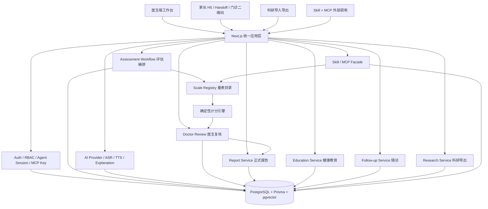

# 02 总体架构与使用路径图

本文是 AI 量表系统当前架构的仓库内权威说明。外部研究包或汇报材料可以从本文同步，但系统设计、实现边界和长期维护以仓库内文档为准。

## 架构原则

系统采用“一个统一底座，四类入口”的架构：医生端、家长 H5/Handoff、科研端、Skill/MCP 外部调用可以有不同交互面，但共用同一套量表目录、评估会话、确定性计分、医生复核、正式报告、健康教育、随访任务、科研导出和审计模型。

核心边界：

- 量表题目、选项、版本和计分由本地代码确定，AI 不自由计算量表分数。
- 家长/患者与医生端答题保持干净原题，一道题一个页面。
- 题目解释可以调用后台配置的 AI/知识库 Provider，但 AI 只解释，不改答案、不提交答案。
- 正式报告必须经过医生复核，家长端不能看到未复核正式报告。
- 科研数据从真实临床流程、复核、报告查看、健康教育、随访和 AI 交互日志中沉淀。

## 当前模块落点

| 模块 | 当前主要位置 | 当前状态 |
|---|---|---|
| 页面入口 | `app/`、`components/mobile-h5/` | 医生、管理、Handoff、Agent、移动 H5 入口已存在。 |
| API 入口 | `app/api/` | Skill、MCP、assessment、doctor、research、admin、speech 都已进入真实接口层。 |
| 量表定义 | `lib/schemas/**` | 目标量表内置并带确定性计分。 |
| 量表目录 | `lib/scales/catalog.ts` | Source of Truth 是 registry + catalog metadata。 |
| AI Provider | `lib/agent/**`、`lib/services/*ai*`、`app/admin/apikeys` | 项目侧统一管理 text/asr/tts/provider/model/key。 |
| Skill Facade | `app/api/skill/v1/*`、`packages/assessment-skill/src/server/*` | 用户态 agent session token 鉴权。 |
| MCP | `app/api/mcp`、`lib/mcp/**` | 系统态 MCP API Key 鉴权，保留 canonical、scale、memory 入口。 |
| 医生服务 | `lib/services/doctor-care.ts`、`lib/services/clinic-screenings.ts` | 患者、邀填、门诊筛查、医生复核、正式报告、导出基础已具备。 |
| 科研导入导出 | `lib/services/research-import.ts`、`lib/services/research-export.ts` | 历史 CSV 导入、字段映射、缺失值标记、脱敏导出和研究衍生表已进入模型与服务层。 |
| AI 会话日志 | `lib/services/ai-conversation-log.ts`、`lib/services/ai-decision-audit.ts` | 记录 ASR、确认、fallback、TTS、tool call 和最终答案提交轨迹。 |

## Source of Truth

- 量表题目、选项、版本、评分：`lib/schemas/**` 与 `lib/scales/catalog.ts`。
- 当前评估过程：`AssessmentSession`。
- 已完成评估事实：`AssessmentHistory`。
- 题级明细和科研结构化项：`ScaleScore`、`resultDetails.answerDetails`。
- 医生复核：`DoctorReview`。
- 正式报告：`AssessmentReport`、`ReportTemplate`、`ReportView`。
- 健康教育：`EducationContent`、`EducationDelivery`。
- 随访：`FollowUpTask`、`ReminderLog`。
- 科研导入导出：`ResearchImportBatch`、`ResearchImportRow`、`ResearchFieldMapping`、`ResearchDerivedDataset`、`ResearchExportLog`。
- AI 交互：`AiConversationSession`、`AiConversationEvent`、`AiDecisionLog`、`AiInteraction`。
- MCP 调用：`McpToolLog` 为 canonical 工具审计，`McpLog` 保留 legacy 兼容记录。
- 生产运行配置：应用 env 留在服务器；项目 AI Key 在 `/admin/apikeys`。

## 当前完成度与后续打磨

当前架构已经不是纯设想版：`DoctorReview`、`AssessmentReport`、`ReportTemplate`、`EducationContent`、`EducationDelivery`、`FollowUpTask`、`ReminderLog`、`ResearchImportBatch`、`ResearchDerivedDataset`、`AiConversationSession`、`AiConversationEvent`、`AiDecisionLog`、`McpToolLog` 等对象已经进入 Prisma schema 和服务/API 层。

仍需继续产品化的重点：

- 医生、家长、科研和管理后台的页面体验继续补齐空态、筛选、详情、导出和审计 drilldown。
- 门诊二维码手机筛查和 H5 提交流程需要持续做真实设备验证。
- 科研端已具备导入导出和脱敏边界，但还需要更完整的研究队列、批次复核和导出管理页面。
