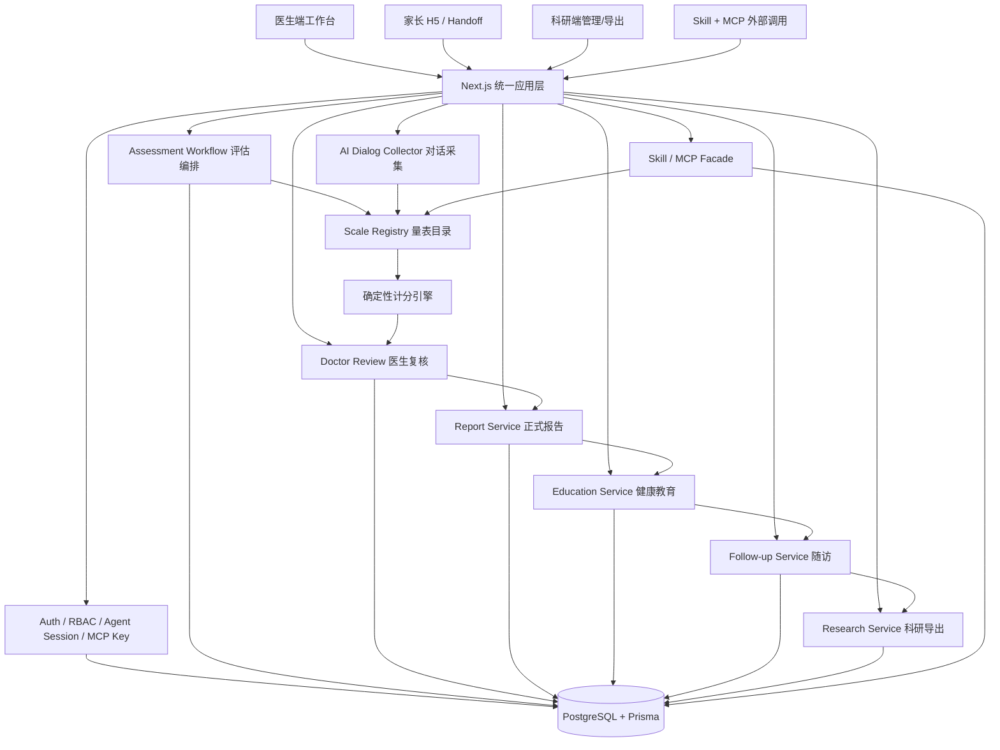
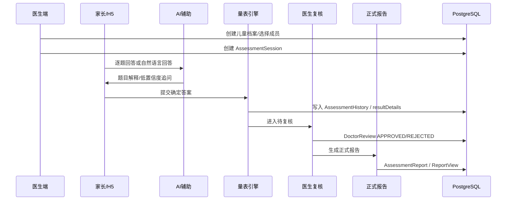

# 02 总体架构与使用路径图

## 架构原则

本系统采用“一个统一底座，四类入口”的架构。医生端、家长 H5、科研端、Skill/MCP 外部调用可以有不同交互面，但不能各写一套数据模型、评分引擎、报告逻辑或权限规则。

## 当前模块落点

| 模块 | 当前主要位置 | Phase 0 判断 |
|---|---|---|
| 页面入口 | `app/`、`mobile-h5-prototype/` | 医生、管理、Handoff、Agent 已有入口。 |
| API 入口 | `app/api/` | Skill、MCP、assessment、doctor、research、admin 都已存在。 |
| 量表定义 | `lib/schemas/**` | 目标量表均为内置量表，含题目和确定性计分。 |
| 量表目录 | `lib/scales/catalog.ts` | Source of Truth 是 registry + catalog metadata。 |
| Skill Facade | `app/api/skill/v1/*`、`packages/assessment-skill/src/server/*` | 用户态 agent session token 鉴权。 |
| MCP | `app/api/mcp`、`lib/mcp/**` | 系统态 MCP API Key 鉴权，有 canonical 和兼容入口。 |
| 医生服务 | `lib/services/doctor-care.ts`、`lib/services/clinic-screenings.ts` | 患者、邀填、门诊筛查、导出基础已具备。 |
| 科研导出 | `lib/services/research-export.ts`、`lib/services/research-events.ts` | 已有脱敏导出和事件记录。 |
| AI 解释/建议 | `app/api/scales/analyze-conversation`、`lib/services/assessment-advice.ts`、平台知识接口 | 可作为辅助，不可成为最终计分或审批源。 |

## 核心数据流

## Source of Truth

- 量表题目、选项、版本、评分：`lib/schemas/**` 与 `lib/scales/catalog.ts`。
- 当前评估过程：`AssessmentSession`。
- 已完成评估事实：`AssessmentHistory`。
- 题级明细和科研结构化项：`ScaleScore`、`resultDetails.answerDetails`。
- AI 辅助行为：`AiInteraction`，后续需扩展为完整 `AiDecisionLog` 或补齐字段。
- MCP 调用：`McpLog`，后续需扩展工具名、入参摘要、输出摘要、错误码和 trace。
- 正式报告：当前缺失独立 source of truth，Phase 1/5 应新增 `AssessmentReport`。

