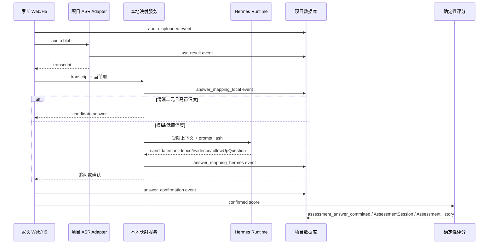

# Phase 9 家长纯语音答题与 AI 控制面第一阶段计划

## 目标

把家长 Web/H5 量表答题收口到项目侧可审计链路：浏览器录音由项目 ASR adapter 转写，项目代码先做本地答案映射，不确定表达再请求 Hermes 辅助理解和追问建议，家长确认后由项目代码校验选项、写答案、计算分数、生成报告和医生复核任务。Hermes 是 runtime，不是业务裁决者；OpenWebUI/Hermes 控制台只作为超级管理员可见的工程调试入口。

## 明确不做

- 不登录服务器，不同步云端，不改 Nginx、域名、HTTPS、Docker volume、服务器 env 或 Hermes 数据目录。
- 不改 Hermes 核心源码，不让 Hermes 直写数据库、定最终分数、越权读数据或执行非白名单工具。
- 不做医生端、电话机器人、硬件机器人端。
- 不做多供应商全集成；本阶段只保留 SiliconFlow ASR 兼容链路，新增 Volcengine TTS adapter，浏览器 TTS 仍默认。
- 不从 OpenWebUI 导正式审计或科研训练数据。

## Source of Truth

| 主题 | 权威来源 |
|---|---|
| 量表题目、选项、版本、计分 | `lib/schemas/**`、`lib/scales/catalog.ts`、`evaluateScaleAnswers` |
| 进行中答题 | `AssessmentSession.answers/currentQuestionIndex/status` |
| 完成评估事实 | `AssessmentHistory.answers/resultDetails` |
| 逐轮 AI/语音会话 | 新增 `AiConversationSession`、`AiConversationEvent` |
| 答案映射决策 | 继续使用 `AiDecisionLog`，必要时由事件引用同一上下文 |
| 工具调用事实 | 继续使用 `McpToolLog` |
| 科研脱敏导出 | `lib/services/research-export.ts` + `ResearchExportLog` |
| Provider/key/model | `ApiKey.serviceType` 归一为 `text/asr/tts`，密钥仍用 `secretCiphertext` |
| AI/语音运行配置 | `SystemConfig.agentWorkspaceConfig` 扩展 `models`/`voice`/`consoleLinks` |

## 模块边界

- `lib/services/apiKeyProviderConfig.ts`：定义 provider 默认 endpoint/model 和 `ApiServiceType = text | asr | tts`，兼容读取旧 `speech`。
- `lib/agent/config.ts`：项目 AI 控制面配置 schema，保存文本、ASR、TTS、控制台链接和语音参数，不保存 Hermes 上游密钥。
- `lib/services/asr/*` 与 `lib/services/tts/*`：项目侧语音 adapter。ASR 先接现有 SiliconFlow SenseVoiceSmall；TTS 先接浏览器模式配置和 Volcengine API adapter。
- `lib/services/voice-answer-mapping.ts`：本地二元答案/模糊表达识别、阈值策略、Hermes 辅助映射输出校验。
- `lib/realtime/hermes.ts`：只增加项目侧 Hermes structured answer mapping 调用封装，不改 Hermes runtime。
- `lib/services/ai-conversation-log.ts`：会话与事件落库，统一事件类型、上下文关联、promptHash/configVersion/runtime metadata。
- `app/api/voice-intent` 与 `app/api/skill/v1/*`：继续作为 Web/H5 语音入口，返回受限结构化结果。
- `app/admin/ai-control` 或现有 `/admin/agent`：超级管理员统一 AI 控制面，展示 ASR/TTS 配置、Hermes/OpenWebUI 调试链接、日志入口。
- `app/admin/ai-logs` + `app/api/admin/ai-conversations`：超级管理员日志中心。
- `lib/services/research-export.ts`：把 AI 会话事件加入默认脱敏导出表，不导出直接身份字段，不导出原始未脱敏训练集。

## 接口契约

### 语音答题请求

`POST /api/skill/v1/speech/transcribe`

- 入参：`audio`、`context=questionnaire`、可选 `assessmentSessionId/scaleId/questionId`。
- 出参：`text`、`confidence`、`provider`、`model`、`conversationSessionId`。
- 失败：返回可见错误并写 `error`/`fallback` 事件。

`POST /api/voice-intent`

- 入参：`mode=questionnaire`、`scaleId`、`questionId`、`transcript`、`language`、可选 `assessmentSessionId/conversationSessionId`。
- 出参：`result.intent`、`result.answer`、`confidence`、`meta.evidence`、`meta.followUpQuestion`、`meta.needsConfirmation`、`source=local|hermes|fallback`。
- 约束：最终答案只能是当前题合法 score；`<0.6` 或不确定表达必须追问；`0.6-0.8` 必须确认；`>=0.8` 仅非敏感题可接受。

### 后台配置

`GET/POST /api/admin/agent/config`

- 仅 `SUPER_ADMIN` 可访问。
- 新增配置：`models.asrProvider/asrModel/ttsProvider/ttsModel`、`voice.ttsMode`、`voice.voiceId/speed/pitch/format`、`consoleLinks.hermesUrl/openWebuiUrl`。
- URL 未配置时前端隐藏链接。

### 会话日志

`GET /api/admin/ai-conversations`

- 仅 `SUPER_ADMIN` 可访问。
- 筛选：成员、量表、会话、时间、provider、低置信度、确认状态。

`GET /api/admin/ai-conversations/[id]`

- 返回会话摘要、逐轮事件、答案提交轨迹、关联 `AiDecisionLog/McpToolLog` 摘要。

## 数据流

## 事件类型

`audio_uploaded`、`asr_result`、`user_utterance`、`assistant_prompt`、`answer_mapping_local`、`answer_mapping_hermes`、`answer_confirmation`、`tool_call`、`tts_output`、`fallback`、`error`、`assessment_answer_committed`。

每条事件至少支持：`userId`、`memberProfileId`、`assessmentSessionId`、`assessmentHistoryId`、`doctorProfileId`、`scaleId`、`questionId`、`hermesConversationId`、`provider`、`model`、`confidence`、`confirmedLowConfidence`、`metadata`、`promptHash`、`configVersion`。

## 风险与验证

- 旧 `speech` 数据必须兼容为 `asr`，新写入只允许 `text/asr/tts`。
- Hermes 异常不能静默成功，必须写 `fallback`/`error` 事件并要求确认或追问。
- 低置信度未确认不能提交。
- OpenWebUI 链接只超级管理员可见，未配置隐藏，文案说明仅工程调试。
- 科研导出默认脱敏，新增 AI 会话事件表必须经过 `DIRECT_IDENTIFIER_FIELDS` 清洗。
- 验证命令：`npx prisma validate`、相关 `npm exec -- tsx --test ...`、`npm run build`。
